# chorus

A Claude Code skill that drops multi-advisor guardrails onto any **SDLC
stage** — most often a spec or a feature's design, occasionally a
full-codebase sweep. Nine persona advisors review the stage through
their lens:

- **Eric Evans** — DDD / domain model
- **Mark Richards** — architecture & evolvability
- **Alan Cooper** — adversarial product
- **Don Norman** — human-centred design
- **Uncle Bob** — clean code / SOLID
- **Kent Beck** — TDD / simple design
- **Delivery-and-Ops** — synthesized (Farley · Hightower · Majors)
- **Security-and-Trust** — synthesized (Schneier · Shostack · Nather)
- **Eliyahu Goldratt** — Theory of Constraints; deferral / opportunity cost, modernized by Reinertsen flow economics

An optional **Guido** (Python) language lens joins only on rounds with Python in
scope. Conflicts go to `advisor()`. Output is a durable markdown artifact you
commit; the most recent artifact is the next round's baseline.

## Four modes

The skill runs in four modes — three *review* modes built on the same four-stage
gate primitive (`skill/chorus/GATE-PRIMITIVE.md`: extract → uncapped
author → real adversarial vote → deterministic tally), plus a navigational
onboarding tutorial:

- **Project-state round** — a multi-lens review of a scope you choose: most
  often a spec or a feature's design, occasionally the whole codebase (the
  periodic full sweep). Trigger: **"spawn the chorus."** Output:
  `docs/reviews/YYYY-MM-DD-chorus-review.md`.
- **Agent-SDLC** (lifecycle) — runs three scoped chorus gates over a single
  feature as it moves through plan → tasks → implement (design review after
  `plan`, plan/tasks review after `tasks`, implementation review after
  `implement`). It reviews an existing spec; it does not require you to author
  one first. Each gate is RSVP-scoped,
  capped at five lenses, and blocks the pipeline only on an unresolved 🔴.
  Trigger: **"run the agent-SDLC on feature 0NN."** Driven by
  `skill/chorus/SDLC-LAYER.md`; output:
  `specs/<feature>/agent-sdlc-log.md`.
- **`chorus challenge`** (premise pass, standalone) — grills a target's
  **premise** (problem / necessity-now / framing / load-bearing assumptions) and
  steelmans the null or an alternative, on any spec, design note, or raw idea.
  It is Gate A's premise pass run on its own — same brief, fixed red-team
  checklist, and substantive honest-null, defined once in
  `skill/chorus/SDLC-LAYER.md` (§ Gate A — premise pass). The same pass runs first
  inside every Gate A. Trigger: **"chorus challenge `<target>`."**
- **`chorus learn`** (tutorial) — an interactive staged onboarding that teaches
  setup and the review modes via the AskUserQuestion tool, one step at a time,
  mutating nothing except one opt-in scaffold. Trigger: **"chorus learn."**
  Defined in `skill/chorus/LEARN.md`. **New here? Start with this.**

The gate primitive is shared so the review modes cannot drift. The rest of this
README describes the project-state round.

## Why

Two patterns this skill is built to resist:

- **Findings dominated by legacy code.** Without an exclusion gate, every
  review collapses onto the same tech-debt directory and crowds out signal
  from the actively-developed surface. The skill's Phase-0 scope-exclusion
  gate prevents this by baking the project's "do not produce findings about
  these paths" list into every persona brief.
- **Findings without scaffolding.** The artifact is a durable baseline; the
  next round assumes its top-5 either closed or explicitly carried forward.
  Without that discipline, every chorus re-derives the same blockers.

Two design choices worth knowing about:

- **RSVP per round.** Personas self-select into each round based on the
  since-last-chorus deltas. Quorum is odd (3 or 5) to avoid 2-vs-2
  deadlocks. If too few join, the round aborts honestly rather than fake a
  chorus.
- **Dijkstra-grounded integration layer.** The session running the skill is
  a thin orchestrator with explicit refusals — it routes between personas,
  the user, and `advisor()`, but never holds a lens, never adds findings of
  its own, never substitutes `advisor()` for cognitive work. See
  `skill/chorus/INTEGRATION-LAYER.md`.

## Lifecycle of a review

```mermaid
flowchart TD
    Start([User: &quot;spawn the chorus&quot;]) --> P0

    subgraph P0[Phase 0 — Brief]
        direction TB
        P0a[Load CHORUS-PROJECT.md addendum<br/>or interview the user inline]
        P0b[Confirm scope-exclusion list]
        P0c[Confirm roster &amp; security toggle]
        P0a --> P0b --> P0c
    end

    P0 --> P05

    subgraph P05[Phase 0.5 — RSVP]
        direction TB
        P05a[Draft round-context paragraph<br/>commits, specs, infra, incidents since last round]
        P05b[Dispatch all roster personas in parallel<br/>each replies JOIN or ABSTAIN]
        P05a --> P05b
    end

    P05 --> Quorum{Joiners?}
    Quorum -- J &lt; 3 --> Abort([Abort honestly<br/>write -chorus-abstained.md])
    Quorum -- J ≥ 3 --> P07

    subgraph P07[Phase 0.7 — Exploratory phase]
        direction TB
        P07a[Each joiner builds a persisted,<br/>lens-specific understanding — reference-first]
        P07b[Orchestrator: one batched, sessioned<br/>operator interview ≤5 Q/session]
        P07a --> P07b
    end

    P07 --> P1

    subgraph P1[Phase 1 — Round 1]
        direction TB
        P1a[Spawn joiners in parallel<br/>self-contained briefs]
        P1b[Each persona: read artefacts,<br/>chase the why-why-why chain]
        P1c[Evidence gate I8 — every finding<br/>cites file:line or principle tag]
        P1a --> P1b --> P1c
    end

    P1 --> Register[Findings register + consolidation matrix]
    Register --> P2

    subgraph P2[Phase 2 — Cross-evaluation]
        direction TB
        P2a[One Round-2 agent per joiner]
        P2b[Each reacts to others&apos; findings:<br/>sharpen, push back, overreach, retract]
        P2a --> P2b
    end

    P2 --> P3

    subgraph P3[Phase 3 — Conflict reconciliation]
        P3a[Identify Cn conflicts<br/>single advisor call arbitrates]
    end

    P3 --> P4

    subgraph P4[Phase 4 — Ranking]
        P4a[Score on Cost / Value / Convergence<br/>+ Constitutional ROI if governance doc exists<br/>→ top-5]
    end

    P4 --> P5

    subgraph P5[Phase 5 — Sign-off]
        direction TB
        P5a[TL;DR + pre-public-rollout gate<br/>+ next-chorus baseline]
        P5b[advisor sanity pass]
        P5a --> P5b
    end

    P5 --> Artifact[(docs/reviews/&lt;date&gt;-chorus-review.md<br/>commit it)]
    Artifact --> End([Round complete])

    classDef phase fill:#f5f5f5,stroke:#333,stroke-width:1px;
    class P0,P05,P07,P1,P2,P3,P4,P5 phase;
```



The integration layer (the calling session) is a thin orchestrator. It routes
between personas, the user, and `advisor()`, but never holds a lens, never
adds findings of its own, and never substitutes `advisor()` for cognitive
work. The invariants enforcing that — including the **I8 evidence gate** the
diagram references — live in
[`skill/chorus/INTEGRATION-LAYER.md`](skill/chorus/INTEGRATION-LAYER.md).

Before Round 1, participating advisors run the **exploratory phase**: each builds
and persists a lens-specific understanding of the target, harvested
reference-first over a **two-tier memory** — the operator-owned
`CHORUS-PROJECT.md` addendum as the authoritative project base, plus thin
per-advisor records that may cache from it. Persisted memory is an index of
locators, never a finding's evidentiary endpoint — findings re-ground in the live
material. The mechanic lives in
[`skill/chorus/EXPLORATORY-PHASE.md`](skill/chorus/EXPLORATORY-PHASE.md).

## Principles

The chorus is a procedure for surfacing trade-offs. It is not a substitute
for the engineering principles a project anchors trade-offs against. Three
cross-cutting concerns recur across every lens — they aren't a separate
doctrine layered on top of the personas, they're how each persona
*already* reads code through their own vocabulary:

| Concern | Cooper / Norman read it as | Evans reads it as | Richards reads it as | Beck reads it as | Uncle Bob reads it as | Delivery-and-Ops reads it as | Security-and-Trust reads it as | Goldratt reads it as |
|---|---|---|---|---|---|---|---|---|
| **Interface contracts** | a promise the user can read | Published Language at a bounded-context boundary | the coupling-type decision at the seam | making the change easy before making the easy change | Dependency Inversion at the architectural seam | the surface a smoke test, canary, or rollback gate can assert against | the trust boundary — what crosses it, who's authoritative, what's enforced | the hypothesis the work is betting on — the boundary past which a non-constraint may be subordinated |
| **Local purity / explicit effects** | hidden cost shifted onto the user | a Domain Event the model refuses to acknowledge | undocumented temporal or content coupling | a function that can't be cornered by a unit test | SRP and the principle of least astonishment, from two angles | three failure modes presented as one — blast radius compounds silently | a hidden grant of capability the threat model never accounted for | a deferral whose downstream cost is hidden — opportunity cost that must be priced, not buried |
| **Behavioural assertions** | a promise nobody is keeping | an aggregate invariant nobody enforces | the cheapest fitness function | the red of red-green-refactor | a blocker, not a nit | the cheapest signal — the CI gate you can afford | a threat-model claim with no test = security theatre | a defer/cut claim with no settling experiment — an opinion, not a finding |

Each persona carries these as their own concerns in their own voice — see
the agent files under [`agents/`](agents/). Optional language lenses carry the
same three concerns in their language's grain — e.g. Guido (Python): an unsigned
type-hint contract, a mutable-default side effect, an idiom claim no type or test
can pin (`agents/guido-python-reviewer.md`). When two lenses independently judge a
finding **under-rated** (the `PRIORITIZE` vote) in a chorus round, it escalates one
severity level. Mere agreement at the proposed severity (the `CONFIRM` vote) counts as
convergence for *ranking* but does not escalate — so popular polish stays polish.
(Vote vocabulary `PRIORITIZE` / `CONFIRM` / `OVER-RATE`; see `skill/chorus/GATE-PRIMITIVE.md`.)

Projects with stronger or more-specific principles (layer rules, language
mandates, infrastructure constraints) declare them in section 4 of
[`templates/CHORUS-PROJECT.template.md`](templates/CHORUS-PROJECT.template.md)
under "Constitutional / governance principles." Phase 4 ranking consumes
that list under "Constitutional ROI."

Findings cite either `file:line` (claims about the project's artefacts)
or `[principle]` (claims grounded in a project-named principle the
addendum carries). The I8 evidence gate refuses findings that do
neither — see [`skill/chorus/INTEGRATION-LAYER.md`](skill/chorus/INTEGRATION-LAYER.md).

## Lens coverage

Which agent owns which axis. Score per cell: **3** primary remit · **2**
secondary strength · **1** incidental · `·` none. A column with no `3` is an
axis no single lens owns — structurally under-represented.

| Agent (lens) | Dom | Arch | Craft | Test | UX | Prod | Prio | Deliv | Obs | Sec | Perf | Data |
|---|:-:|:-:|:-:|:-:|:-:|:-:|:-:|:-:|:-:|:-:|:-:|:-:|
| **Evans** — DDD / domain | **3** | 2 | 2 | 1 | · | 1 | · | · | · | · | · | 2 |
| **Richards** — architecture / -ilities | 1 | **3** | 1 | 2 | · | · | 1 | 1 | 1 | 1 | 2 | 1 |
| **Uncle Bob** — clean code / SOLID | 1 | 2 | **3** | 2 | · | · | · | · | · | · | · | · |
| **Kent Beck** — TDD / simple design | 1 | 1 | **3** | **3** | · | 1 | 1 | 1 | · | · | · | · |
| **Norman** — human-centred UX | · | · | · | · | **3** | 2 | 1 | · | · | · | · | · |
| **Cooper** — adversarial product | 1 | · | · | · | 2 | **3** | 2 | · | · | · | · | · |
| **Delivery-and-Ops** — Farley/Hightower/Majors | · | 1 | · | 2 | · | · | 2 | **3** | **3** | · | 1 | · |
| **Security-and-Trust** — Schneier/Shostack/Nather | · | 1 | · | 1 | · | · | 2 | 1 | 1 | **3** | · | 2 |
| **Goldratt** — ToC/Reinertsen | · | 1 | 1 | 1 | · | 2 | **3** | 2 | 1 | · | 1 | · |
| **Breadth (Σ)** | 7 | 11 | 10 | 12 | 5 | 9 | 12 | 8 | 6 | 4 | 4 | 5 |
| **Champion? (any 3)** | ✓ | ✓ | ✓ | ✓ | ✓ | ✓ | ✓ | ✓ | ✓ | ✓ | — | — |

**Axis key:** **Dom** Domain modeling · **Arch** Architecture & evolvability ·
**Craft** Code craft & maintainability · **Test** Testing & correctness ·
**UX** Human / UX & usability · **Prod** Product value & user goals ·
**Prio** Prioritization, deferral & cost · **Deliv** Delivery & operability ·
**Obs** Observability & prod feedback · **Sec** Security & trust ·
**Perf** Performance & efficiency · **Data** Data integrity & persistence.

Two axes — **Performance** and **Data integrity** — have no champion: they are
covered only as a side effect of other remits (Richards on performance; Evans
and Security-and-Trust on data). If neither of those lenses RSVPs into a round,
the axis goes dark. Optional language lenses (e.g. Guido for Python) layer their
own grain on top per language and aren't scored here. The live, interactive
version of this matrix — heatmap, radar, and per-axis breakdown — is at
[`docs/reviews/2026-06-05-chorus-coverage-map.html`](docs/reviews/2026-06-05-chorus-coverage-map.html).

## Install

### Canonical (clone + script)

```sh
git clone https://github.com/<your-org>/chorus.git
cd chorus
./install.sh
```

This copies the skill into `~/.claude/skills/chorus/` and its
persona agents into `~/.claude/agents/`. Existing same-named files are
preserved unless you pass `--force`.

Override the target with `CLAUDE_HOME=/path/to/claude ./install.sh`.

### Plugin (Claude Code plugin manifest)

The repo ships a `plugin.json` so it can be loaded via Claude Code's plugin
mechanism. See your Claude Code version's plugin-installation docs for the
exact incantation; the manifest at the root is the canonical entry point.

### Uninstall

```sh
./uninstall.sh
```

Removes only the skill dir and its persona agent files. Your per-project
addenda and chorus artifacts under `docs/reviews/` are left untouched.

## Run a round

**New here? Say `chorus learn`** — a guided tutorial that orients you, helps set
up the addendum (it can scaffold it for you on request), and teaches both review
modes one step at a time. Everything below is the manual path.

1. **Set up the addendum** — let `chorus learn` scaffold it, or copy the
   installed template into your project:

   ```sh
   cp ~/.claude/skills/chorus/templates/CHORUS-PROJECT.template.md \
      docs/reviews/CHORUS-PROJECT.md
   ```

2. **Edit it.** Sections 2 (exclusions), 3 (anchor surface), and 5
   (project-specific security checklist) are required before the chorus can
   launch. The skill will interview you inline if the file is missing or
   incomplete, but a filled-in addendum makes every round faster.

3. **In Claude Code, say:**

   > spawn the chorus

   The orchestrator will load the addendum, confirm the scope-exclusion list
   with you, draft the round-context paragraph (deltas since the last
   round), and run the RSVP gate. Each persona that joins produces a Round 1
   report; cross-evaluation, conflict reconciliation via `advisor()`,
   ranking, and security follow. The final artifact lands at
   `docs/reviews/YYYY-MM-DD-chorus-review.md`. Commit it.

## What you get

A markdown artifact structured as:

- Roster (this round) — joiners, abstainers, why.
- Findings register — every finding `F1`, `F2`, … with severity, lens,
  target, one-sentence summary.
- Consolidation matrix — for ranking and scoring.
- Round briefs — what each round produced as a whole.
- Phase 3 conflict reconciliation — every `Cn`, what was disputed, how it
  was settled.
- Top-5 ranked recommendations — scored on Cost / Value / Convergence
  (and Constitutional ROI if your project has a governance doc).
- Pre-public-rollout gate — any 🔴 blockers tracked as a unit.
- TL;DR — three sentences at the top.
- Next-chorus baseline — what the next round should assume closed.

## When NOT to use this

- Single-lens questions — just spawn the relevant persona agent directly.
- Line-by-line review of a PR diff — use a dedicated code-review tool; the
  chorus reviews specs and design, not diffs.
- One-off architecture questions — invoke `mark-richards-architect` solo.

The chorus is usually pointed at a spec or a feature's design; a full-codebase
sweep is the occasional periodic case, not the default. For the full sweep,
cadence is typically quarterly or after a major release.

## License

CC BY 4.0. See `LICENSE`. You may copy, modify, and redistribute these
skills, agents, and procedure under the terms of that license, including
for commercial use — attribution required per the license text.

## Contributing

See `CONTRIBUTING.md`. Short version: PRs welcome; do not include
project-specific examples (paths, hostnames, user names, repo names) in
PR'd agent descriptions or skill prose.
