# chorus-review

A Claude Code skill that runs a structured multi-advisor review of your
project state. Seven persona advisors — Eric Evans (DDD), Mark Richards
(architecture), Alan Cooper (adversarial product), Don Norman (HCD),
Uncle Bob (clean code / SOLID), Kent Beck (TDD / simple design), and a
synthesized delivery-and-ops advisor — plus a security agent each review
your repo through their lens. Conflicts go to `advisor()`. Output is a
durable markdown artifact under `docs/reviews/` that you commit. The most
recent artifact is the next round's baseline.

## Why

Two patterns this skill is built to resist:

- **Findings dominated by legacy code.** Without an exclusion gate, every
  review collapses onto the same tech-debt directory and crowds out signal
  from the actively-developed surface. The skill's Phase-0 scope-exclusion
  gate prevents this by baking the project's "do not produce findings about
  these paths" list into every persona brief.
- **Naming-without-shipping.** A review document is not a fix. Phase 6
  forces the chorus to offer the highest-priority concrete fix as a PR draft
  immediately after sign-off, so the artifact does not replace the work it
  describes.

Two design choices worth knowing about:

- **RSVP per round.** Personas self-select into each round based on the
  since-last-chorus deltas. Quorum is odd (3 or 5) to avoid 2-vs-2
  deadlocks. If too few join, the round aborts honestly rather than fake a
  chorus.
- **Dijkstra-grounded integration layer.** The session running the skill is
  a thin orchestrator with explicit refusals — it routes between personas,
  the user, and `advisor()`, but never holds a lens, never adds findings of
  its own, never substitutes `advisor()` for cognitive work. See
  `skill/chorus-review/INTEGRATION-LAYER.md`.

## Lifecycle of a review

```mermaid
flowchart TD
    Start([User: &quot;spawn the chorus&quot;]) --> P0

    subgraph P0[Phase 0 — Brief]
        direction TB
        P0a[Load CHORUS-PROJECT.md addendum<br/>or interview the user inline]
        P0b[Confirm scope-exclusion list]
        P0c[Confirm roster &amp; security toggle]
        P0a --> P0b --> P0c
    end

    P0 --> P05

    subgraph P05[Phase 0.5 — RSVP]
        direction TB
        P05a[Draft round-context paragraph<br/>commits, specs, infra, incidents since last round]
        P05b[Dispatch all roster personas in parallel<br/>each replies JOIN or ABSTAIN]
        P05a --> P05b
    end

    P05 --> Quorum{Joiners?}
    Quorum -- J &lt; 3 --> Abort([Abort honestly<br/>write -chorus-abstained.md])
    Quorum -- J ≥ 3 --> P1

    subgraph P1[Phase 1 — Round 1]
        direction TB
        P1a[Spawn joiners in parallel<br/>self-contained briefs]
        P1b[Each persona: read artefacts,<br/>chase the why-why-why chain]
        P1c[Evidence gate I8 — every finding<br/>cites file:line or principle tag]
        P1a --> P1b --> P1c
    end

    P1 --> Register[Findings register + consolidation matrix]
    Register --> P2

    subgraph P2[Phase 2 — Cross-evaluation]
        direction TB
        P2a[One Round-2 agent per joiner]
        P2b[Each reacts to others&apos; findings:<br/>sharpen, push back, overreach, retract]
        P2a --> P2b
    end

    P2 --> P3

    subgraph P3[Phase 3 — Conflict reconciliation]
        P3a[Identify Cn conflicts<br/>single advisor call arbitrates]
    end

    P3 --> P4

    subgraph P4[Phase 4 — Ranking]
        P4a[Score on Cost / Value / Convergence<br/>+ Constitutional ROI if governance doc exists<br/>→ top-5]
    end

    P4 --> Sec{Security<br/>addendum?}
    Sec -- yes --> SecPass[General-purpose agent<br/>with data-surface checklist] --> ReRank[Re-rank top-5 if security 🔴 lands]
    Sec -- no --> P5
    ReRank --> P5

    subgraph P5[Phase 5 — Sign-off]
        direction TB
        P5a[TL;DR + pre-public-rollout gate<br/>+ next-chorus baseline]
        P5b[advisor sanity pass]
        P5a --> P5b
    end

    P5 --> Artifact[(docs/reviews/&lt;date&gt;-chorus-review.md<br/>commit it)]
    Artifact --> P6

    subgraph P6[Phase 6 — Don&apos;t replace the work]
        P6a[Offer the highest-priority fix as a PR draft<br/>&quot;want me to draft the Fn fix PR now?&quot;]
    end

    P6 --> End([Round complete])

    classDef phase fill:#f5f5f5,stroke:#333,stroke-width:1px;
    class P0,P05,P1,P2,P3,P4,P5,P6 phase;
```



The integration layer (the calling session) is a thin orchestrator. It routes
between personas, the user, and `advisor()`, but never holds a lens, never
adds findings of its own, and never substitutes `advisor()` for cognitive
work. The invariants enforcing that — including the **I8 evidence gate** the
diagram references — live in
[`skill/chorus-review/INTEGRATION-LAYER.md`](skill/chorus-review/INTEGRATION-LAYER.md).

## Principles

The chorus is a procedure for surfacing trade-offs. It is not a substitute
for the engineering principles a project anchors trade-offs against. Three
cross-cutting concerns recur across every lens — they aren't a separate
doctrine layered on top of the personas, they're how each persona
*already* reads code through their own vocabulary:

| Concern | Cooper / Norman read it as | Evans reads it as | Richards reads it as | Beck reads it as | Uncle Bob reads it as | Delivery-and-Ops reads it as |
|---|---|---|---|---|---|---|
| **Interface contracts** | a promise the user can read | Published Language at a bounded-context boundary | the coupling-type decision at the seam | making the change easy before making the easy change | Dependency Inversion at the architectural seam | the surface a smoke test, canary, or rollback gate can assert against |
| **Local purity / explicit effects** | hidden cost shifted onto the user | a Domain Event the model refuses to acknowledge | undocumented temporal or content coupling | a function that can't be cornered by a unit test | SRP and the principle of least astonishment, from two angles | three failure modes presented as one — blast radius compounds silently |
| **Behavioural assertions** | a promise nobody is keeping | an aggregate invariant nobody enforces | the cheapest fitness function | the red of red-green-refactor | a blocker, not a nit | the cheapest signal — the CI gate you can afford |

Each persona carries these as their own concerns in their own voice — see
the agent files under [`agents/`](agents/). When two lenses converge on the
same concern from different angles in a chorus round, the finding earns
🔴 severity.

Projects with stronger or more-specific principles (layer rules, language
mandates, infrastructure constraints) declare them in section 4 of
[`templates/CHORUS-PROJECT.template.md`](templates/CHORUS-PROJECT.template.md)
under "Constitutional / governance principles." Phase 4 ranking consumes
that list under "Constitutional ROI."

Findings cite either `file:line` (claims about the project's artefacts)
or `[principle]` (claims grounded in a project-named principle the
addendum carries). The I8 evidence gate refuses findings that do
neither — see [`skill/chorus-review/INTEGRATION-LAYER.md`](skill/chorus-review/INTEGRATION-LAYER.md).

## Install

### Canonical (clone + script)

```sh
git clone https://github.com/<your-org>/chorus-review.git
cd chorus-review
./install.sh
```

This copies the skill into `~/.claude/skills/chorus-review/` and the seven
persona agents into `~/.claude/agents/`. Existing same-named files are
preserved unless you pass `--force`.

Override the target with `CLAUDE_HOME=/path/to/claude ./install.sh`.

### Plugin (Claude Code plugin manifest)

The repo ships a `plugin.json` so it can be loaded via Claude Code's plugin
mechanism. See your Claude Code version's plugin-installation docs for the
exact incantation; the manifest at the root is the canonical entry point.

### Uninstall

```sh
./uninstall.sh
```

Removes only the skill dir and the seven named agent files. Your per-project
addenda and chorus artifacts under `docs/reviews/` are left untouched.

## Run a round

1. **Drop the template into your project:**

   ```sh
   cp ~/code/chorus-review/templates/CHORUS-PROJECT.template.md \
      docs/reviews/CHORUS-PROJECT.md
   ```

2. **Edit it.** Sections 2 (exclusions), 3 (anchor surface), and 5
   (project-specific security checklist) are required before the chorus can
   launch. The skill will interview you inline if the file is missing or
   incomplete, but a filled-in addendum makes every round faster.

3. **In Claude Code, say:**

   > spawn the chorus

   The orchestrator will load the addendum, confirm the scope-exclusion list
   with you, draft the round-context paragraph (deltas since the last
   round), and run the RSVP gate. Each persona that joins produces a Round 1
   report; cross-evaluation, conflict reconciliation via `advisor()`,
   ranking, and security follow. The final artifact lands at
   `docs/reviews/YYYY-MM-DD-chorus-review.md`. Commit it.

## What you get

A markdown artifact structured as:

- Roster (this round) — joiners, abstainers, why.
- Findings register — every finding `F1`, `F2`, … with severity, lens,
  target, one-sentence summary.
- Consolidation matrix — for ranking and scoring.
- Round briefs — what each round produced as a whole.
- Phase 3 conflict reconciliation — every `Cn`, what was disputed, how it
  was settled.
- Top-5 ranked recommendations — scored on Cost / Value / Convergence
  (and Constitutional ROI if your project has a governance doc).
- Pre-public-rollout gate — any 🔴 blockers tracked as a unit.
- TL;DR — three sentences at the top.
- Next-chorus baseline — what the next round should assume closed.

## When NOT to use this

- Single-lens questions — just spawn the relevant persona agent directly.
- Code review of a specific PR — use a dedicated review tool, not this.
- One-off architecture questions — invoke `mark-richards-architect` solo.

The chorus is for periodic project-state review. Cadence depends on your
project; quarterly or after-each-major-release is typical.

## License

CC BY 4.0. See `LICENSE`. You may copy, modify, and redistribute these
skills, agents, and procedure under the terms of that license, including
for commercial use — attribution required per the license text.

## Contributing

See `CONTRIBUTING.md`. Short version: PRs welcome; do not include
project-specific examples (paths, hostnames, user names, repo names) in
PR'd agent descriptions or skill prose.
