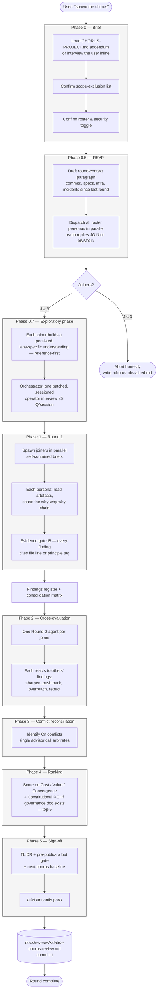

# chorus

A Claude Code skill suite that runs a structured multi-advisor review of **whatever
you point it at** — most often a spec or a feature's design, occasionally a
full-codebase sweep. Nine persona advisors, each reviewing the target through
their lens:

- **Eric Evans** — DDD / domain model
- **Mark Richards** — architecture & evolvability
- **Alan Cooper** — adversarial product
- **Don Norman** — human-centred design
- **Uncle Bob** — clean code / SOLID
- **Kent Beck** — TDD / simple design
- **Delivery-and-Ops** — synthesized (Farley · Hightower · Majors)
- **Security-and-Trust** — synthesized (Schneier · Shostack · Nather)
- **Goldratt** — Eliyahu M. Goldratt (Theory of Constraints; deferral / opportunity cost), modernized by Reinertsen flow economics

An optional **Guido** (Python) language lens joins only on rounds with Python in
scope. Conflicts go to `advisor()`. Output is a durable markdown artifact you
commit; the most recent artifact is the next round's baseline.

## The suite — four skills over one substrate

The chorus is packaged as a **composable suite** of four skills. The shared
mechanics live once in a substrate skill; the two review modes compose it by
name and never depend on each other, and a tutorial skill teaches both:

- **`chorus-core`** — substrate (not invoked directly). The four-stage gate
  primitive (`skill/chorus-core/GATE-PRIMITIVE.md`: extract → uncapped author →
  real adversarial vote → deterministic tally), the decision primitive
  (`DECISION-PRIMITIVE.md`), the exploratory phase (`EXPLORATORY-PHASE.md`), and
  the conductor discipline + the single `I1–I9` invariant catalog
  (`CONDUCTOR.md`). It also documents the **reserved seams** (extract-stage
  record, agent-memory layout, two-tier memory model) and the **findings→memory
  contract** future skills compose.
- **`chorus-review`** — the **project-state round**: a multi-lens review of a
  scope you choose (most often a spec or a feature's design; occasionally the
  whole codebase). Trigger: **"spawn the chorus."** Output:
  `docs/reviews/YYYY-MM-DD-chorus-review.md`.
- **`chorus-sdlc`** — the **agent-SDLC lifecycle**: three scoped chorus gates
  over a single feature as it moves through plan → tasks → implement (design
  review after `plan`, plan/tasks review after `tasks`, implementation review
  after `implement`). Each gate is RSVP-scoped, capped at five lenses, and blocks
  the pipeline only on an unresolved 🔴. Trigger: **"run the agent-SDLC on
  feature 0NN."** Output: `specs/<feature>/agent-sdlc-log.md`.
  It also exposes **`chorus challenge`** — Gate A's **premise pass** run
  standalone, grilling a target's premise (problem / necessity-now / framing /
  load-bearing assumptions) and steelmanning the null or an alternative, on any
  spec, design note, or raw idea. Same brief, fixed red-team checklist, and
  substantive honest-null, defined once in `skill/chorus-sdlc/SKILL.md`
  (§ Gate A — premise pass); the same pass runs first inside every Gate A.
  Trigger: **"chorus challenge `<target>`."**
- **`chorus-learn`** — a guided, staged **tutorial**: setup (the per-project
  addendum, which it can scaffold on request from the template it ships at
  `skill/chorus-learn/templates/CHORUS-PROJECT.template.md`) and both review
  modes. Trigger: **"chorus learn."**

Both modes run the **same** gate primitive from `chorus-core`, so they cannot
drift. Each sibling declares `REQUIRED: chorus-core` and carries a sibling-side
guard that fails loudly if the substrate is absent. The rest of this README
describes the project-state round (`chorus-review`).

### Composition

The chorus names no outside skill. It declares **ports** — decision sink, ruling
lookup, record validator, record renderer, arbiter, fixed viewpoint, memory recall
(`skill/chorus-core/CONDUCTOR.md` § Ports) — and a composition root binds them.
Without one, each port's default applies (ask in chat, `advisor()`, hand-written
pages marked unrendered, and so on) and the round record says which ran unbound.

## Why

Two patterns this skill is built to resist:

- **Findings dominated by legacy code.** Without an exclusion gate, every
  review collapses onto the same tech-debt directory and crowds out signal
  from the actively-developed surface. The skill's Phase-0 scope-exclusion
  gate prevents this by baking the project's "do not produce findings about
  these paths" list into every persona brief.
- **Findings without scaffolding.** The artifact is a durable baseline; the
  next round assumes its top-5 either closed or explicitly carried forward.
  Without that discipline, every chorus re-derives the same blockers.

Two design choices worth knowing about:

- **RSVP per round.** Personas self-select into each round based on the
  since-last-chorus deltas. Quorum is odd (3 or 5) to avoid 2-vs-2
  deadlocks. If too few join, the round aborts honestly rather than fake a
  chorus.
- **Dijkstra-grounded integration layer.** The session running the skill is
  a thin orchestrator with explicit refusals — it routes between personas,
  the user, and `advisor()`, but never holds a lens, never adds findings of
  its own, never substitutes `advisor()` for cognitive work. See
  `skill/chorus-core/CONDUCTOR.md`.

## Lifecycle of a review


```mermaid
flowchart TD
    Start([User: &quot;spawn the chorus&quot;]) --> P0

    subgraph P0[Phase 0 — Brief]
        direction TB
        P0a[Load CHORUS-PROJECT.md addendum<br/>or interview the user inline]
        P0b[Confirm scope-exclusion list]
        P0c[Confirm roster &amp; security toggle]
        P0a --> P0b --> P0c
    end

    P0 --> P05

    subgraph P05[Phase 0.5 — RSVP]
        direction TB
        P05a[Draft round-context paragraph<br/>commits, specs, infra, incidents since last round]
        P05b[Dispatch all roster personas in parallel<br/>each replies JOIN or ABSTAIN]
        P05a --> P05b
    end

    P05 --> Quorum{Joiners?}
    Quorum -- J &lt; 3 --> Abort([Abort honestly<br/>write -chorus-abstained.md])
    Quorum -- J ≥ 3 --> P07

    subgraph P07[Phase 0.7 — Exploratory phase]
        direction TB
        P07a[Each joiner builds a persisted,<br/>lens-specific understanding — reference-first]
        P07b[Orchestrator: one batched, sessioned<br/>operator interview ≤5 Q/session]
        P07a --> P07b
    end

    P07 --> P1

    subgraph P1[Phase 1 — Round 1]
        direction TB
        P1a[Spawn joiners in parallel<br/>self-contained briefs]
        P1b[Each persona: read artefacts,<br/>chase the why-why-why chain]
        P1c[Evidence gate I8 — every finding<br/>cites file:line or principle tag]
        P1a --> P1b --> P1c
    end

    P1 --> Register[Findings register + consolidation matrix]
    Register --> P2

    subgraph P2[Phase 2 — Cross-evaluation]
        direction TB
        P2a[One Round-2 agent per joiner]
        P2b[Each reacts to others&apos; findings:<br/>sharpen, push back, overreach, retract]
        P2a --> P2b
    end

    P2 --> P3

    subgraph P3[Phase 3 — Conflict reconciliation]
        P3a[Identify Cn conflicts<br/>single advisor call arbitrates]
    end

    P3 --> P4

    subgraph P4[Phase 4 — Ranking]
        P4a[Score on Cost / Value / Convergence<br/>+ Constitutional ROI if governance doc exists<br/>→ top-5]
    end

    P4 --> P5

    subgraph P5[Phase 5 — Sign-off]
        direction TB
        P5a[TL;DR + pre-public-rollout gate<br/>+ next-chorus baseline]
        P5b[advisor sanity pass]
        P5a --> P5b
    end

    P5 --> Artifact[(docs/reviews/&lt;date&gt;-chorus-review.md<br/>commit it)]
    Artifact --> End([Round complete])

    classDef phase fill:#f5f5f5,stroke:#333,stroke-width:1px;
    class P0,P05,P07,P1,P2,P3,P4,P5 phase;
```

The integration layer (the calling session) is a thin orchestrator. It routes
between personas, the user, and `advisor()`, but never holds a lens, never
adds findings of its own, and never substitutes `advisor()` for cognitive
work. The invariants enforcing that — including the **I8 evidence gate** the
diagram references — live in
[`skill/chorus-core/CONDUCTOR.md`](skill/chorus-core/CONDUCTOR.md); the round
itself is [`skill/chorus-review/SKILL.md`](skill/chorus-review/SKILL.md).

Before Round 1, participating advisors run the **exploratory phase**: each builds
and persists a lens-specific understanding of the target, harvested
reference-first over a **two-tier memory** — the operator-owned
`CHORUS-PROJECT.md` addendum as the authoritative project base, plus thin
per-advisor records that may cache from it. Persisted memory is an index of
locators, never a finding's evidentiary endpoint — findings re-ground in the live
material. The mechanic lives in
[`skill/chorus-core/EXPLORATORY-PHASE.md`](skill/chorus-core/EXPLORATORY-PHASE.md).

## Principles

The chorus is a procedure for surfacing trade-offs. It is not a substitute
for the engineering principles a project anchors trade-offs against. Three
cross-cutting concerns recur across every lens — they aren't a separate
doctrine layered on top of the personas, they're how each persona
*already* reads code through their own vocabulary:

| Concern | Cooper / Norman read it as | Evans reads it as | Richards reads it as | Beck reads it as | Uncle Bob reads it as | Delivery-and-Ops reads it as | Security-and-Trust reads it as | Goldratt reads it as |
|---|---|---|---|---|---|---|---|---|
| **Interface contracts** | a promise the user can read | Published Language at a bounded-context boundary | the coupling-type decision at the seam | making the change easy before making the easy change | Dependency Inversion at the architectural seam | the surface a smoke test, canary, or rollback gate can assert against | the trust boundary — what crosses it, who's authoritative, what's enforced | the hypothesis the work is betting on — the boundary past which a non-constraint may be subordinated |
| **Local purity / explicit effects** | hidden cost shifted onto the user | a Domain Event the model refuses to acknowledge | undocumented temporal or content coupling | a function that can't be cornered by a unit test | SRP and the principle of least astonishment, from two angles | three failure modes presented as one — blast radius compounds silently | a hidden grant of capability the threat model never accounted for | a deferral whose downstream cost is hidden — opportunity cost that must be priced, not buried |
| **Behavioural assertions** | a promise nobody is keeping | an aggregate invariant nobody enforces | the cheapest fitness function | the red of red-green-refactor | a blocker, not a nit | the cheapest signal — the CI gate you can afford | a threat-model claim with no test = security theatre | a defer/cut claim with no settling experiment — an opinion, not a finding |

Each persona carries these as their own concerns in their own voice — see
the agent files under [`agents/`](agents/). Optional language lenses carry the
same three concerns in their language's grain — e.g. Guido (Python): an unsigned
type-hint contract, a mutable-default side effect, an idiom claim no type or test
can pin (`agents/guido-python-reviewer.md`). When two lenses independently judge a
finding **under-rated** (the `PRIORITIZE` vote) in a chorus round, it escalates one
severity level. Mere agreement at the proposed severity (the `CONFIRM` vote) counts as
convergence for *ranking* but does not escalate — so popular polish stays polish.
(Vote vocabulary `PRIORITIZE` / `CONFIRM` / `OVER-RATE`; see `skill/chorus-core/GATE-PRIMITIVE.md`.)

Projects with stronger or more-specific principles (layer rules, language
mandates, infrastructure constraints) declare them in section 4 of
[`skill/chorus-learn/templates/CHORUS-PROJECT.template.md`](skill/chorus-learn/templates/CHORUS-PROJECT.template.md)
under "Constitutional / governance principles." Phase 4 ranking consumes
that list under "Constitutional ROI."

Findings cite either `file:line` (claims about the project's artefacts)
or `[principle]` (claims grounded in a project-named principle the
addendum carries). The I8 evidence gate refuses findings that do
neither — see [`skill/chorus-core/CONDUCTOR.md`](skill/chorus-core/CONDUCTOR.md).

## Lens coverage

Which agent owns which axis. Score per cell: **3** primary remit · **2**
secondary strength · **1** incidental · `·` none. A column with no `3` is an
axis no single lens owns — structurally under-represented.

| Agent (lens) | Dom | Arch | Craft | Test | UX | Prod | Prio | Deliv | Obs | Sec | Perf | Data |
|---|:-:|:-:|:-:|:-:|:-:|:-:|:-:|:-:|:-:|:-:|:-:|:-:|
| **Evans** — DDD / domain | **3** | 2 | 2 | 1 | · | 1 | · | · | · | · | · | 2 |
| **Richards** — architecture / -ilities | 1 | **3** | 1 | 2 | · | · | 1 | 1 | 1 | 1 | 2 | 1 |
| **Uncle Bob** — clean code / SOLID | 1 | 2 | **3** | 2 | · | · | · | · | · | · | · | · |
| **Kent Beck** — TDD / simple design | 1 | 1 | **3** | **3** | · | 1 | 1 | 1 | · | · | · | · |
| **Norman** — human-centred UX | · | · | · | · | **3** | 2 | 1 | · | · | · | · | · |
| **Cooper** — adversarial product | 1 | · | · | · | 2 | **3** | 2 | · | · | · | · | · |
| **Delivery-and-Ops** — Farley/Hightower/Majors | · | 1 | · | 2 | · | · | 2 | **3** | **3** | · | 1 | · |
| **Security-and-Trust** — Schneier/Shostack/Nather | · | 1 | · | 1 | · | · | 2 | 1 | 1 | **3** | · | 2 |
| **Goldratt** — ToC/Reinertsen | · | 1 | 1 | 1 | · | 2 | **3** | 2 | 1 | · | 1 | · |
| **Breadth (Σ)** | 7 | 11 | 10 | 12 | 5 | 9 | 12 | 8 | 6 | 4 | 4 | 5 |
| **Champion? (any 3)** | ✓ | ✓ | ✓ | ✓ | ✓ | ✓ | ✓ | ✓ | ✓ | ✓ | — | — |

**Axis key:** **Dom** Domain modeling · **Arch** Architecture & evolvability ·
**Craft** Code craft & maintainability · **Test** Testing & correctness ·
**UX** Human / UX & usability · **Prod** Product value & user goals ·
**Prio** Prioritization, deferral & cost · **Deliv** Delivery & operability ·
**Obs** Observability & prod feedback · **Sec** Security & trust ·
**Perf** Performance & efficiency · **Data** Data integrity & persistence.

Two axes — **Performance** and **Data integrity** — have no champion: they are
covered only as a side effect of other remits (Richards on performance; Evans
and Security-and-Trust on data). If neither of those lenses RSVPs into a round,
the axis goes dark. Optional language lenses (e.g. Guido for Python) layer their
own grain on top per language and aren't scored here. The live, interactive
version of this matrix — heatmap, radar, and per-axis breakdown — is at
[`docs/reviews/2026-06-05-chorus-coverage-map.html`](docs/reviews/2026-06-05-chorus-coverage-map.html).

## Requirements

**Hard:**

- **speckit skills** (`speckit-plan`, `speckit-tasks`, `speckit-implement`, …)
  for `chorus-sdlc` — its gates interleave with the speckit cycle.
  `chorus-review` and `chorus-learn` do not need them.
- **The `advisor()` tool** — conflict reconciliation (Phase 3) routes disputes
  to it. Without it the chorus records each conflict, unresolved, for you to
  rule on.

**Optional:**

- **spec-walkthrough** — run headless, its spec-to-code reconciliation digest
  feeds the review (the fixed viewpoint at `chorus-sdlc` Gate C).
- **memsearch** — recall of past-session context when the round context is
  drafted; the project's own memory surface works too.

## Install

The suite is named **chorus**. Both channels below
deliver the same four skills (`chorus-core`, `chorus-review`, `chorus-sdlc`,
`chorus-learn`, including their subfolders such as the addendum template) and
the ten persona agents.

### Clone + script

```sh
git clone https://github.com/zaytsevand/chorus.git
cd chorus
./install.sh
```

`install.sh` copies each `skill/<name>/` directory into
`~/.claude/skills/<name>/` and the persona agents into `~/.claude/agents/`.
Every file it writes is recorded, with a hash of what it wrote, in
`~/.claude/.chorus-install-manifest`. Re-running it is safe and is how you
upgrade: a file still as installed is updated, a file you edited is reported as
"differs, kept" and left alone, and files an earlier version shipped but this
one does not are pruned unless you edited them. Files it did not write are left
alone. `--force` overwrites every shipped file.

The suite requires coryphaeus, the record validator and renderer (a separate
repository), and Node 18 or later: run `./install.sh` in its checkout with the
same `CLAUDE_HOME`.

**Per-project install** — install into one project's `.claude/` instead of your
global config, by pointing `CLAUDE_HOME` at it (run from the project root):

```sh
CLAUDE_HOME=$PWD/.claude <repo>/install.sh
```

### Plugin

The repo is a Claude Code plugin: the manifest is
[`.claude-plugin/plugin.json`](.claude-plugin/plugin.json) (plugin name
`chorus`; check it with `claude plugin validate <repo>`). Load it from a
checkout for a session with:

```sh
claude --plugin-dir <repo>
```

### Uninstall

```sh
./uninstall.sh                              # global install
CLAUDE_HOME=$PWD/.claude <repo>/uninstall.sh   # per-project install
```

Removes the files listed in the install manifest that are still as installed,
then the manifest. A listed file you edited is reported as "differs, kept" and
left alone. Files `install.sh` skipped (because they already existed) are left
alone, as are your per-project addenda and chorus artifacts under `docs/reviews/`.

## Run a round

1. **Set up the project addendum.** Say **"chorus learn"** and accept its
   scaffold offer, or copy the template yourself:

   ```sh
   cp <repo>/skill/chorus-learn/templates/CHORUS-PROJECT.template.md \
      docs/reviews/CHORUS-PROJECT.md
   ```

2. **Edit it.** Sections 2 (exclusions), 3 (anchor surface), and 5
   (project-specific security checklist) are required before the chorus can
   launch. The skill will interview you inline if the file is missing or
   incomplete, but a filled-in addendum makes every round faster.

3. **In Claude Code, say:**

   > spawn the chorus

   The orchestrator will load the addendum, confirm the scope-exclusion list
   with you, draft the round-context paragraph (deltas since the last
   round), and run the RSVP gate. Each persona that joins produces a Round 1
   report; cross-evaluation, conflict reconciliation via `advisor()`,
   ranking, and security follow. The final artifact lands at
   `docs/reviews/YYYY-MM-DD-chorus-review.md`. Commit it.

## What you get

A markdown artifact structured as:

- Roster (this round) — joiners, abstainers, why.
- Findings register — every finding `F1`, `F2`, … with severity, lens,
  target, one-sentence summary.
- Consolidation matrix — for ranking and scoring.
- Round briefs — what each round produced as a whole.
- Phase 3 conflict reconciliation — every `Cn`, what was disputed, how it
  was settled.
- Top-5 ranked recommendations — scored on Cost / Value / Convergence
  (and Constitutional ROI if your project has a governance doc).
- Pre-public-rollout gate — any 🔴 blockers tracked as a unit.
- TL;DR — three sentences at the top.
- Next-chorus baseline — what the next round should assume closed.

## When NOT to use this

- Single-lens questions — just spawn the relevant persona agent directly.
- Line-by-line review of a PR diff — use a dedicated code-review tool; the
  chorus reviews specs and design, not diffs.
- One-off architecture questions — invoke `mark-richards-architect` solo.

The chorus is usually pointed at a spec or a feature's design; a full-codebase
sweep is the occasional periodic case, not the default. For the full sweep,
cadence is typically quarterly or after a major release.

## License

CC BY 4.0. See `LICENSE`. You may copy, modify, and redistribute these
skills, agents, and procedure under the terms of that license, including
for commercial use — attribution required per the license text.

## Contributing

See `CONTRIBUTING.md`. Short version: PRs welcome; do not include
project-specific examples (paths, hostnames, user names, repo names) in
PR'd agent descriptions or skill prose.
