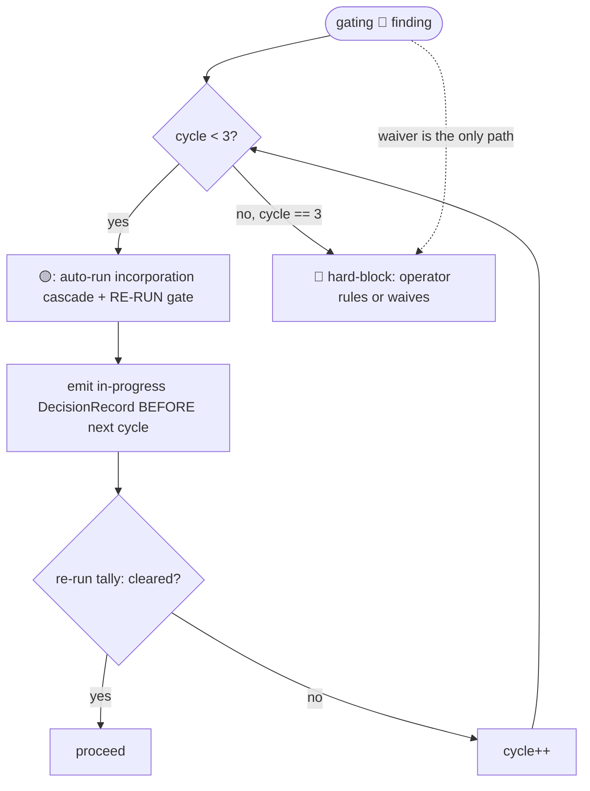

# Chorus Decision Primitive

This is the **single canonical definition** of how the chorus decides *when to involve
the operator*, and of how a board is seated. Both the review round (chorus-review) and
the lifecycle reviews (chorus-sdlc) route their operator-facing decisions through *this*
mechanic. There is exactly one copy; neither mode restates it.

The discipline, after Fowler's *Fragments*: **make feedback unnecessary where you can,
instant where you cannot, and build a real review surface for each decision.** The chorus
**partitions** the operator's judgment — auto-resolving the decidable, defaulting-with-review
the reversible, and stopping the human only for the irreducible.

## The three bands

Every operator-facing decision is classified by a **sensor** into one band, reusing the
chorus 🔴🟡🟢 vocabulary — now for a *decision*, not a finding's severity.

| Band | When | Behavior | Fowler move |
|------|------|----------|-------------|
| 🟢 **GREEN** | mechanically decidable (no judgment) | auto-resolve · audit-log · proceed | feedback *unnecessary* |
| 🟡 **YELLOW** | judgment, but reversible / low-stakes | proceed with a **recorded default** · queue for **async override** | better *review surface* |
| 🔴 **RED** | judgment **and** irreversible / high-stakes | **hard-block** · instant minimal framed ask | feedback *instant* |

The workflow **runs forward** by default, accumulating 🟡 decisions on a review surface,
and stops dead **only for 🔴**. That is the whole of "self-unblocking yet balanced."

> **Band ≠ finding severity.** A finding whose *severity* is 🔴 produces, at first, a 🟡
> *decision* — "auto-incorporate and re-verify" (see The self-heal loop). The *decision*
> becomes 🔴 only at the loop bound or on a waiver. Keep the two senses distinct.
> Findings and decisions share the three-level 🔴🟡🟢 scale owned by `GATE-PRIMITIVE.md`.

## The sensor

```mermaid
flowchart TD
    d([decision reached]) --> cat{catalog row?}
    cat -->|no| red1[🔴 ask — unclassified is never auto-resolved]
    cat -->|yes| pred{evaluate predicate\nmechanical | persona-flag}
    pred -->|green| g[🟢 auto-resolve · audit row · proceed]
    pred -->|yellow| y[🟡 apply recorded default · queue card · proceed]
    y -.->|operator overrides async| rr[re-run from recorded point @ cost]
    pred -->|red| r[🔴 hard-block · live card · WAIT — no default]
```

1. **Catalog lookup** by decision `point`. **No entry → 🔴** (the safe direction is the
   lazy direction — an unclassified decision is treated as judgment until declared).
2. **Predicate evaluation** — a **mechanical** test (sort strictness, a cycle counter, an
   artefact-presence check) or a **persona-declared flag** (a seated lens asserting "this
   gap blocks my finding"). The orchestrator **counts and routes; it never infers** a band.
3. **Act by band** per the table above.

## The RSVP signal (two evidence-anchored axes)

Seating decisions consume a two-axis signal. Each JOIN reply carries:

- **A — applicability**: `applies: [<cited round-context delta>, …]` — at least one
  **concrete delta** the lens touches. An empty `applies` is treated as **not-applicable**
  (abstain-eligible); a JOIN that cites a delta is never out-seated by one that cannot.
- **B — expected stakes**: `expected: 🟢|🟡|🔴-potential` + a one-line evidence hook.

The seating sensor sorts seated candidates by **(quality/count of `applies`, then
`expected`)**, recording the anchors. The orchestrator counts; it never assigns axes
(extends I2). Evidence-anchoring is the I8 rule applied to scoring: an un-anchored claim
is demoted.

## Seating

Seating applies to **every board** — the review round's base board and every lifecycle
gate alike. It is a *decision* banded by catalog rows 1–2; the persona's RSVP is its own
(I2).

- **Cap of five ordinary seats.** Let `J` = ordinary JOIN replies. `3 ≤ J ≤ 5` → seat all.
  `J ≥ 6` → sort by the two-axis signal; a **strict** order at the 5th seat is 🟢
  (auto-seat); a **tie** spanning the 5th seat is 🟡 — seat a recorded default panel and
  queue it for async override, **never an operator interruption**. `J < 3` → re-ping every
  abstainer once with the same added context; the second failure aborts the review
  honestly (I3). The orchestrator sorts persona-supplied evidence under a declared band; it
  never judges lens merit (D1).
- **Exceptional entry** (uncapped, rare). A lens may enter *beyond* the five by an RSVP
  answer that **cites a concrete round-context delta no seated ordinary lens covers**. The
  bar is **evidence, not an adjudicator**: an un-anchored "I'm exceptional" claim is
  **refused** (I8/D5); distinct entries must cite **distinct** uncovered deltas
  (duplicate-delta claims do not each earn a seat). An exceptional seat confers a
  **voice, not weight** — its vote counts exactly as an ordinary seat's (severity stays
  arithmetic, `GATE-PRIMITIVE.md` Stage 4). Seated board size =
  `min(roster, min(5, |ordinary JOIN|) + |exceptional|)`. Exceptional entries (with cited
  deltas) and the ordinary/exceptional split are recorded in the ledger.
- **No mandate.** No actor pins, approves, or compels a seat — not the orchestrator, not
  the operator, not a catalog row. A lens that cannot articulate an uncovered delta is not
  seated; that is the bar working, not exclusion. Where a lens's absence carries risk, the
  conductor files a **flag-only side-note** (`CONDUCTOR.md` § Side-notes) — never an
  auto-seat.
- **Role guardrail.** When the cap forces an ordinary out-seat, "covered by a seated
  lens" is judged by the lens's **role, not by overlapping findings** — one shared finding
  does not transfer a lens's role.

## The DecisionRecord

Every decision emits one record; the band decides how richly it is surfaced.

```
DecisionRecord {
  id            : <gate/phase>-<point>-<n>
  point         : which decision
  band          : 🟢 | 🟡 | 🔴
  sensor: { signal, evidence, reading }      // the rule that fired + its anchors + outcome
  resolution    : auto-resolved | default-applied | in-progress | hard-block
  chosen        : the selected option
  alternatives  : the runner-up(s) weighed
  override      : <how to reverse + cost>    // 🟡 only
}
```

`hard-block` is a 🔴 the workflow cannot pass until the operator rules (not `escalated`:
a decision sink may use that word for a decision that does not block). `in-progress` represents the transient 🟡-while-cycling state of a self-heal in flight (so
a live decision is representable, not only its rest-states).

## Review surfaces (render by band)

- **🟢 → audit row.** One line in the ledger.
- **🟡 → review-queue card** in the ledger section `## Provisional decisions (review &
  override)`: the chosen default, the runner-up(s), `sensor.evidence`, and a **one-action
  override + its cost**. This is the load-bearing surface — where async judgment lands.
- **🔴 → live framed card**: the judgment, **2–4 options each with its consequence**, the
  evidence, the default highlighted, **and the operator's act-and-confirm affordance**.
- **In-flight signifier** (self-heal): each cycle's DecisionRecord (`resolution:
  in-progress`, "cycle N of 3 + gate verdict") is appended to `## Provisional decisions`
  **before the next cycle starts** (visible before cycle 2, not batched at loop end), and
  the orchestrator emits a one-line narrator update to the operator's live surface
  ("self-heal cycle N/3 — <verdict>"), so an in-flight self-heal reads as *progress*, not
  runaway or silence.

## The self-heal loop (gating 🔴 findings)

A post-tally **gating 🔴 finding** is a 🟡 *decision* while `cycle < 3`:



- The **re-run gate is the verifying sensor** — "verify before you ask."
- The cycle counter is **per-gate-invocation** (not per-finding-identity), so a finding
  that mutates each cycle still hits the bound.
- Raise a 🔴 hard-block at `cycle == 3` **or** when a waiver of a real concern is the only
  path. A waiver is **never** applied automatically.
- This stays inside the existing gate guarantees: **S4** (a 🔴 is *resolved and verified*,
  never passed silently), **S5** (spec-sourced incorporation, no hand-patching), **S7**
  (the 3-cycle bound is the RED trigger).

## The decision catalog

The declared band + predicate per decision point. The **load-bearing artefact**: each
row's band is a design-time human decision; the orchestrator only follows it. An unlisted
point defaults to 🔴. (A catalog-correctness check — every operator-ask resolves to a row;
rows 5/8/11 declare no auto-default; every 🟡 row names an override — gates adoption.)

| # | Decision point | Band | Predicate | Reversibility |
|---|----------------|:---:|-----------|---------------|
| 1 | RSVP seating — clean two-axis sort | 🟢 | strict order at the cap boundary (§ Seating) | mechanical |
| 2 | RSVP seating — tie at the cap | 🟡 | non-strict at boundary (§ Seating) | reversible (re-run gate); low-stakes |
| 3 | Gate finding severity (tally) | 🟢 | deterministic stage-4 tally | arithmetic |
| 4 | Proceed past 🟡/🟢 findings | 🟢 | non-gating | no decision |
| 5 | Gating 🔴 finding | 🟡→🔴 | `cycle<3` → 🟡 (auto-incorporate + re-run); `cycle==3` or waiver-only → 🔴 | incorporation reversible (S5); bound/waiver irreducible — **no auto-default** |
| 6 | Exploratory gap — inferable from a cited artefact | 🟢 | a `[ref]` anchor exists | fact present |
| 7 | Exploratory gap — needs operator knowledge, reversible | 🟡 | no `[ref]`, not flagged blocking | recorded assumption + degradation note |
| 8 | Exploratory gap — load-bearing AND irreversible | 🔴 | a seated lens **flags** "blocks my finding" AND no safe default | lens-declared — **no auto-default** |
| 9 | Phase 0 scope/exclusion — addendum present | 🟢 | addendum file exists | deterministic |
| 10 | Phase 0 scope/exclusion — addendum absent | 🟡 | no addendum | infer defaults + async confirm |
| 11 | Final feature sign-off / 🔴 waiver | 🔴 | always | high-stakes — **no auto-default** |
| 12 | Reuse / cross-user deferral sign-off | 🔴 | corpus defers cross-user value, shared reuse, or trust promotion **without** a complete § Deferral checklist row (all columns incl. beneficiary) | high-stakes — **no auto-default**; operator confirms beneficiary + falsifiable instrument |
| 13 | User-value strip (`user-value-strip`) | 🟡 | deferral table or DEFERRED FR present **without** an F-UV strip (§ Deferral checklist) | recorded default: strip requested before sign-off; operator may revise outcome, widen the v1 slice, or record an override |
| 14 | `NEED_INFO` resolution routing | 🟡 | open `NEED_INFO` on a finding (including every `confidence_on_hand: low`); peer path when another seated persona can supply the gap, else operator path | peer reply or operator context is recorded; author revises or confirms; reversible until tally |

## Deferral checklist

The canonical schema for **trust / reuse deferrals** in specs and review corpora.
Consuming projects mirror it in their spec template and addendum.

**When required** — one row per deferred capability when any of: an FR is marked
**DEFERRED** or parked in a follow-up spec; cross-user reuse, trust promotion, or shared
learnings are out of v1 scope; a conscious trade-offs table defers machinery that would
otherwise need schema or API surface. Incorporation is blocked while a DEFERRED item lacks
a complete row (catalog row 12).

**Columns (all required)**

| Column | Question it answers |
|--------|---------------------|
| **ID** | Stable id (`D-001`, `FR-NNN`, …) |
| **Deferred capability** | What is explicitly not built in v1 |
| **Distinct actors** | Who is in scope vs out (per-user vs cross-user) |
| **Completeness predicate** | What must already ship for the deferral to be honest |
| **Trust boundary** | Where enforcement lives (server vs edge; isolation vs shared) |
| **Falsifiable un-defer instrument** | Metric/event that proves un-defer is earned — not operator judgment alone |
| **Follow-up spec** | Where deferred scope is preserved (follow-up spec NNN, BACKLOG, …) |
| **Beneficiary of deferral** | Who benefits from waiting: user, operator, or **build team** |

**Anti-theater rule.** Do **not** add schema columns, OpenAPI fields, or entity tables
whose **only** purpose is reserved space for a **DEFERRED** parent FR (e.g. trust status,
promotion counters, cross-user reuse columns). A data-model field needs a non-deferred
consuming FR; if its parent is deferred, use this checklist and a follow-up spec — not
dormant trust machinery in v1.

**User-value strip (F-UV).** When any deferral row or DEFERRED FR is present, the corpus
carries a user-value strip comparing the spec's named primary outcome to what v1 delivers
after deferrals:

| Field | Purpose |
|-------|---------|
| Named outcome | Primary outcome sentence from `## Outcome & Stage-1 proof` |
| v1 outcome | Honest user-visible outcome after deferrals |
| Dimensions | 3–5 user-visible benefits rated **Full / Partial / None** in v1 |
| Estimated value ratio | Approximate % of named outcome delivered in v1 |
| Threshold | Default **20%** for reuse / trust / network-effect outcomes |

If the estimated value ratio is **below threshold** and the primary outcome sentence still
promises deferred value, that is **delivery theater** — an ordinary finding (the product
lens authors F-UV) whose severity comes from the vote like any other — unless the same
change (a) revises the primary outcome to match v1, (b) scopes the minimum viable slice
into v1, or (c) records an operator override with rationale.

**Incorporation.** A deferral or anti-theater finding incorporates by: (1) adding or
completing the checklist row in `spec.md` (the source of truth, S5); (2) regenerating
`plan.md` / `data-model.md` without the dormant trust machinery if the parent FR stays
DEFERRED; (3) re-running the review.

**Absent lenses.** A cross-user / reuse deferral reviewed with no product lens seated, or
with no security lens where trust enforcement is server-bound, draws a flag-only conductor
side-note (`CONDUCTOR.md` § Side-notes); seating stays self-selected (§ Seating).

## Invariants (D1–D5)

Bind every decision — both modes. Extend I1–I9 (conductor) and S1–S11 (lifecycle/gate).

- **D1** — band by **declared predicate**, never inference. (Extends I2/S3/S9.)
- **D2** — **🔴 never auto-proceeds**: hard-block, no default. A severity-🔴 finding is
  *resolved* (auto-incorporate) not *passed*; the *decision* goes 🔴 only at bound/waiver.
  (Extends S4.)
- **D3** — every **🟡 default is recorded and reversible** (a queue card + an override + its
  cost).
- **D4** — **classification is mechanical** (predicate or persona flag); never merit/"feel".
  (Extends S9.)
- **D5** — **signals are evidence-anchored**; un-anchored claims are demoted. (Extends I8.)

## Adoption note

Both modes **reference this file** for the mechanic; they do not restate it. Any change to
bands, the signal, seating, the record, the catalog, the deferral checklist, or the
self-heal loop happens here.

## Provenance

Designed in `docs/superpowers/specs/2026-06-08-self-unblocking-decision-discipline-design.md`
and specified in `specs/006-self-unblocking-decision-discipline/`.
