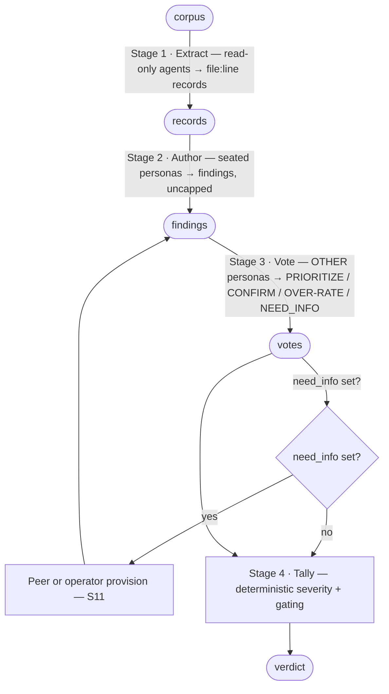
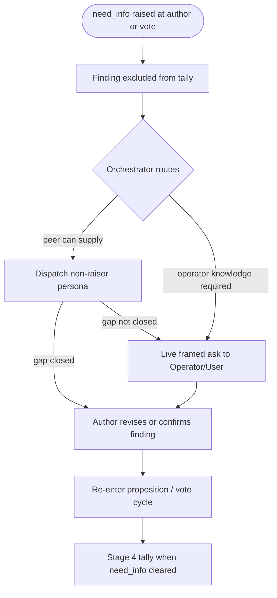

# Chorus Gate Primitive

This is the **single canonical definition** of how a chorus conducts one review.
Both the periodic project-state round (`INTEGRATION-LAYER.md`, Phases 1/2/4) and
the per-feature SDLC gates (`SDLC-LAYER.md`, Gates A/B/C) run *this* mechanic.
There is exactly one copy; neither layer restates it.

A review is four **separable, specialized stages**, each with a distinct actor
and a distinct success criterion. Running them blended is the failure mode this
file exists to prevent: a 2026-06-06 back-test of the constraint-and-flow lens
(today's Goldratt advisor)
showed that when one agent both **authored and graded** findings it ranked the
new lens dead last; when authoring was split from a **real adversarial vote** the
same lens came back mid-pack. Stage separation changed the answer. The stage you
cheap out on is the stage that lies to you — and stage 3 is load-bearing.



## Stage 1 — Extract

- **Actor**: read-only `Explore` / general-purpose agents, in parallel.
- **Input**: the review corpus (for the base round, the artefacts named in the
  brief; for an SDLC gate, the gate's corpus per `SDLC-LAYER.md`).
- **Output**: structured **extract records** — one factual observation each:

  ```
  {
    "artifact":       "<path>",
    "location":       "<file>:<line>" | "<file>:<lineStart>-<lineEnd>",
    "observation":    "<one factual sentence, no judgment>",
    "raw_excerpt":    "<verbatim quote>",
    "candidate_lens": "<lens this most concerns>" | "unassigned",
    "source":         "explore" | "spec-walkthrough"
  }
  ```

- **Success criterion**: coverage of the corpus; every record carries a real
  `file:line` anchor. These anchors are what later satisfy the I8 evidence gate.
- **Must not**: assign severity or author findings (that is stages 2–4).
- **Fixed viewpoint (SDLC Gate C only)**: the headless `spec-walkthrough` digest
  (`Skill(skill: "spec-walkthrough", args: "<NNN> headless")`) is ingested as
  records with `source: "spec-walkthrough"`. It is **not authoritative** — a
  persona must author a record into a finding for it to face the vote; any
  DRIFT/SURPRISE no persona claims is logged as an unclaimed record (visible,
  non-gating). See `SDLC-LAYER.md`.

## Stage 2 — Author

- **Actor**: the seated persona itself, one per lens (in the base round, the
  Round-1 agent; in an SDLC gate, the gate's seated panel).
- **Input**: the extract records plus the persona's own reading of the corpus —
  with the persona's own **gates** satisfied (`EXPLORATORY-PHASE.md`): the
  answers it has declared it cannot honestly review without (who the user is and
  how many, the grading bar, the characteristic ranking, …), each resolved by
  reference or operator confirmation, never invented.
- **Output**: **findings**, each:
  `{id, lens, evidence (file:line | [principle] | [principle:proposed]),
  proposed_severity (🔴/🟡/🟢), pull_quote (one short verbatim sentence in the
  persona's own words — the line the human-facing register relays unedited;
  spec 008-detail-rich-relay), need_info (boolean — open flag on this finding; see
  NEED_INFO below), need_info_reason (string — one sentence when `need_info: true`),
  confidence_on_hand (`high` | `low` — declared per finding; see NEED_INFO below)}`.
  The persona marks this line itself; the orchestrator relays it and never
  paraphrases or excerpts one for the persona.
- **Success criterion**: **uncapped**. The finding count is whatever the corpus
  honestly warrants — there is **no per-author target or quota** (no "3–6", no
  "limit to N"). A word limit, where one exists, bounds the *prose density per
  finding*, never the *number of findings*.
- **Must not**: pad to hit a number; file a project-specific claim with no
  `file:line` and no principle tag (such a finding is demoted to
  `[unsupported]` per I8 and excluded from the tally); **author past an unmet
  gate** — when one of the persona's declared gates is unanswered, the honest
  output is the question itself, with any dependent findings marked
  **conditional on the stated assumption** rather than graded as if the answer
  were known (S10). An unmet exploratory `[gate]` is an **S10 frame gap, not a
  per-finding S11 flag**: the persona leads with the gate question, or marks
  dependent findings conditional on the stated assumption — it does **not** raise
  `need_info` on a finding as a substitute for a missing frame (that boundary is
  the routing rule; S11 owns only gaps that remain once the frame is sufficient).

## Stage 3 — Vote

- **Actor**: the **real** seated personas, in character — **never** the author of
  the finding, **never** a synthetic grader (S8, S9). In the base round this is
  the Phase-2 cross-evaluation; in an SDLC gate it is the gate's vote stage.
- **Input**: the findings register.
- **Output**: per non-author persona, one **declared vote** on each finding it has a
  view on — one of four values:
  - `PRIORITIZE` — **under-rated**: more severe than the author proposed → counts toward escalation.
  - `CONFIRM` — **correctly rated**: agree at the proposed severity → holds; counts as
    convergence for ranking, but **not** toward escalation.
  - `OVER-RATE` — **over-rated**: less severe than proposed → counts toward demotion.
  - `NEED_INFO` — **information gap**: the voter's **confidence in the information on
    hand is low** (`confidence_on_hand: low`), **or** the finding's formulation is
    unclear, **or** the remediation path is not decidable from available evidence →
    sets `need_info: true` on the finding and **excludes this finding from the
    tally** until the flag is resolved (see NEED_INFO below). Does not count toward
    `P`, `C`, or `O`. A voter with `confidence_on_hand: low` **must** declare
    `NEED_INFO` — not `CONFIRM`, `PRIORITIZE`, or `OVER-RATE` with hedged prose.

  The value is **declared by the voter**, never inferred by the orchestrator from prose
  (S9). Abstention on a finding is allowed. The `CONFIRM` value exists so the tally can tell
  "I agree, rank it high" apart from "this is under-rated, escalate" — the ambiguity that
  inflated convergent agreement into gating severity (issue #13; spec `009-confirm-vote-tally`).
- **Success criterion**: adversarial and real — each vote traces to a dispatched
  persona, and no finding is voted on by its own author.
- **Must not**: be predicted, inferred, or summarized by the orchestrator. A
  *predicted* reaction is not a vote.

## NEED_INFO — proposition and vote cycles

`NEED_INFO` is a **per-finding state flag** (`need_info: true`), raised at **Stage 2
(Author)** or **Stage 3 (Vote)** only when the **review frame is otherwise
sufficient** but *this specific finding* cannot honestly proceed. Raising it is
**mandatory** when any trigger below holds — not a discretionary escape hatch.

Its boundary with S10 is settled at the two seams that own each case, so no separate
routing table is needed: an unmet exploratory **`[gate]`** is a frame gap resolved by
S10 at Stage 2 (the persona leads with the gate question, dependent findings
conditional on the stated assumption); `need_info` is only for gaps that **remain on
a specific finding once the frame is sufficient**. Do not use `need_info` to bypass an
open S10 gate — resolve the frame first, then raise S11 for what is left.

### The confidence axis (declared, not inferred)

Every finding at proposition and every vote on a finding carries a **declared**
`confidence_on_hand` assessment. It measures **epistemic sufficiency of the evidence
on hand** — how much the persona trusts what it knows, not whether a fix is obvious:

| Value | Meaning | Effect |
|-------|---------|--------|
| `high` | evidence chain closes for what you *know*; you are not guessing at facts | you **may** author or cast a severity vote — **unless** formulation or remediation is still undecidable (see triggers) |
| `low` | material is thin, ambiguous, second-hand, or you would be guessing | **`need_info: true` is mandatory** — do not author a confident finding or cast a severity vote |

`confidence_on_hand` does **not** cover **decisibility** of formulation or
remediation — those triggers can fire at `high` confidence (solid `file:line`
evidence for a real defect, but no honest fix → `confidence_on_hand: high`,
`need_info: true`). The orchestrator **records** the declared axis; it **never
infers** confidence from tone, hedging, or prose (extends S9/D4). Hedged language
without an explicit `confidence_on_hand: low` + `need_info: true` is a discipline
violation — the honest move is to name low confidence and raise the flag.

### Triggers (any one → `need_info: true`)

- **`confidence_on_hand: low`** — the evidence on hand is insufficient; declare `low`
  and raise the flag (the load-bearing case the confidence axis names).
- **Remediation undecidable** — the persona cannot decisively name what would fix the
  issue (`confidence_on_hand` may be `high` or `low`).
- **Formulation unsure** — the claim, scope, or evidence chain does not close
  (`confidence_on_hand` may be `high` or `low`).

When the trigger is *not* low confidence, declare `confidence_on_hand: high` and still
set `need_info: true`. Raising it is an honesty move, not abstention: the persona names
*what* is missing (`need_info_reason` — one sentence, evidence-anchored where possible).

### What the flag blocks

A finding with **`need_info: true`** must not enter Stage 4 tally. Severity arithmetic
runs only after every open flag on that finding is resolved. A finding may carry
multiple `need_info_reason` entries (one per raiser, recorded in the register);
resolution clears the flag for the finding as a whole once the gap is closed.

### Resolution — exactly two paths (S11)

The orchestrator **routes** resolution; it **never** invents remediation,
reformulates the finding, or guesses the missing context (extends S9/I6). Each
finding with `need_info: true` is resolved through **exactly one** of:

| Path | When | Actor | Outcome |
|------|------|-------|---------|
| **Peer provision** | another seated persona plausibly holds the missing fact, formulation anchor, or remediation path | orchestrator dispatches a **non-raiser** persona with the `need_info_reason` | the peer's reply is recorded; the author **revises or confirms** the finding; the flag clears |
| **Operator provision** | the gap requires project/operator knowledge no seated persona can supply | orchestrator routes a **live framed ask** to the Operator/User | operator context is recorded; the author **revises or confirms** the finding; the flag clears |

The orchestrator picks **one** path per resolution attempt — not both, not a
synthetic blend. If peer provision fails to close the gap, escalate to operator
provision on the **next** resolution attempt (a second routing, not a parallel
ask).

After resolution, the finding **re-enters** the proposition/vote cycle from the
stage where it paused: revised findings may be re-voted; tally runs only when
`need_info` is cleared on that finding.



## Stage 4 — Tally

- **Actor**: the orchestrator, deterministic.
- **Input**: the votes — **only findings with `need_info` cleared** (S11).
- **Output**: each finding's **post-tally severity** and **gating flag**, by the
  fixed **symmetric**, **board-scaled** rule. Let `P` = PRIORITIZE count, `C` = CONFIRM
  count, and `O` = OVER-RATE count among **non-author** voters; `net = P − O` (**CONFIRM
  is excluded from `net`** — agreement-at-severity does not move severity). Let `N` be
  the count of **non-author voters** on the finding and `T = max(1, floor(N / 2))` the
  **board-scaled threshold** (a wider board demands proportionally more agreement, so
  exceptional entry — `SDLC-LAYER.md` seating — cannot make escalation cheaper):

  | Condition | Effect |
  |---|---|
  | `net ≥ T` | escalate one level (🟢→🟡→🔴, capped at 🔴) |
  | `net ≤ −T` | demote one level (🔴→🟡→🟢, 🟢→drop) |
  | `\|net\| < T` | hold author-proposed severity |

  - At the standard full board of 5 (`N = 4`), `T = floor(4/2) = 2` — the rule reduces
    **exactly** to the prior fixed `±2`, so this change is backward-compatible at the
    size the canon was calibrated for. The floor `T ≥ 1` holds for any voted finding; a
    tally **MUST NOT** run at `N < 2`.
  - `net = 0` (all-abstain, or all-CONFIRM, or balanced) holds; an all-abstain
    finding is marked **unvoted** (non-gating, surfaced). A finding held by CONFIRM
    is **agreed-at-severity**, not unvoted — it has real votes, they just don't move it.
  - Movement is **one level per tally**, regardless of margin (a 4–0 OVER-RATE
    demotes 🔴→🟡, not to nothing — the finding survives in the record).
  - A finding is **gating** iff its post-tally severity is 🔴 — full stop. No
    additional judgment clause: the vote is the confirmation.
  - **Convergence count** (for Phase-4 ranking) is `P + C` — all agreement, used to
    *rank*, never to *escalate*. Severity escalation counts only `P`. This decouples
    the two meanings of "convergence" that issue #13 conflated: a finding many lenses
    agree on can rank in the top-5 while honestly holding at 🟡.
- **Success criterion**: arithmetic only — no judgment added. Identical votes at an
  identical `N` always yield identical severities; there are **no tally ties**, and no
  seat's vote is re-weighted (severity is presence-blind — entry buys a voice, not
  weight). (Operator tie-breaking exists only for SDLC **ordinary-seat** cap seating,
  never in the tally.)
- **Must not**: re-weight by lens, author, or orchestrator preference; add a
  judgment clause to the gating decision.
- **Rendered, never re-authored**: this post-tally severity is the value the
  human-facing findings register and its derived matrix display (spec
  `008-detail-rich-relay`, FR-007). Severity lives authoritatively here, in the
  tally; the register renders it, the matrix projects it — neither re-computes it.

Symmetry is deliberate: convergent `PRIORITIZE` escalates just as clear `OVER-RATE`
demotes; a demote-only tally would silently let an author-under-rated finding through.
The older rule was "two lenses converging on a concern earn 🔴" — **amended** by spec
`009-confirm-vote-tally` (closing issue #13): two lenses **both claiming under-rated**
(`PRIORITIZE`) earn the escalation; two lenses merely **agreeing** at the proposed
severity (`CONFIRM`) hold it. Agreement is convergence for *ranking*, not a force on
*severity* — escalation now requires an explicit under-rated claim, not popularity.

## Invariants this primitive carries

These bind every review — the base round and every SDLC gate. They extend the
integration layer’s I1–I9.

- **S8.** The author of a finding is never its grader. Stage 3 dispatches to
  personas *other than* the author; a persona never votes on its own finding.
  (The back-test failure mode: author-grades-self buried the new lens last.)
- **S9.** The orchestrator never synthesizes a vote or a grade. Stage 3 is a real
  dispatch to seated personas; stage 4 aggregates real votes only. A predicted
  reaction is not a vote. (Extends I1/I6 to the voting and tally stages.)
- **S10.** Every persona **names its gates explicitly** — the information needs
  it cannot honestly review without (`[gate]` entries in its profile,
  `EXPLORATORY-PHASE.md`) — and **prompts for an unmet gate instead of inferring
  past it**. A gate resolves only as *referenced* or *operator-confirmed*; while
  it is open, the persona leads with the question and marks dependent findings
  conditional on the stated assumption. The later stages cannot catch a
  wrong-bar review — every vote asks "is this severe *within the frame*," so
  convergent PRIORITIZE amplifies an altitude error rather than correcting it.
  Honesty about the frame lives in each persona's own chain of thought, before
  authoring. (Provenance: a 2026-06-11 gate reviewed single-operator dev tooling
  against an inferred production bar; 13 manufactured gating 🔴 had to be
  operator-overridden wholesale — issue #6.)
- **S11.** When any persona sets `need_info: true` on a finding — at proposition
  (Stage 2) or vote (Stage 3) — the orchestrator **must not** invent remediation,
  reformulate the finding, or infer the missing context. The flag is **per-finding**
  and applies only once the review frame is sufficient; an unmet exploratory `[gate]`
  is an S10 frame gap, not an S11 flag. **`confidence_on_hand: low` → `need_info: true`
  is mandatory**; the axis is declared by the persona, never inferred from hedging.
  The finding **must not** tally until `need_info` is cleared through **exactly one**
  of two paths: **peer provision** (another seated persona supplies the required
  information) or **operator provision** (the Operator/User supplies additional
  context). The orchestrator **routes**; it does not resolve. (Extends S9/I6 to
  information gaps at proposition and vote.)

## Adoption note

`INTEGRATION-LAYER.md` (base round Phases 1/2/4) and `SDLC-LAYER.md` (gates
A/B/C) **reference this file** for the mechanic; they do not restate it. Any
change to extract/author/vote/tally happens here, once, so the two modes cannot
drift. The lifecycle-specific invariants S1–S7 live in `SDLC-LAYER.md`; the
gate-primitive invariants S8–S11 live here because they bind both modes.

## Provenance

Designed in `docs/superpowers/specs/2026-06-06-agent-sdlc-workflow-design.md`
and specified in `specs/003-agent-sdlc-workflow/` (see
`contracts/gate-primitive.md` and `contracts/sdlc-invariants.md`). The
stage-separation rule and S8/S9 come from a 2026-06-06 back-test of the
constraint-and-flow lens.
