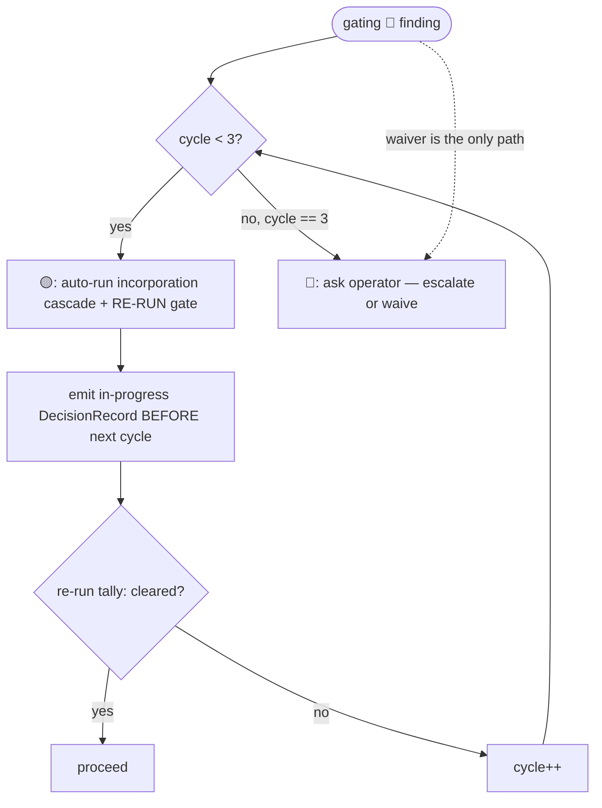

# Chorus Decision Primitive

This is the **single canonical definition** of how the chorus decides *when to involve
the operator*. Both the base round (`INTEGRATION-LAYER.md`) and the SDLC gates
(`SDLC-LAYER.md`) route their operator-facing decisions through *this* mechanic. There is
exactly one copy; neither layer restates it.

The discipline reframes operator involvement after Fowler's *Fragments* (2026-04-29):
**make feedback unnecessary where you can, instant where you cannot, and build a real
review surface for each decision.** The chorus does not *replicate* the operator's
judgment (the failure that parked feature 005); it **partitions** it — auto-resolving the
decidable, defaulting-with-review the reversible, and stopping the human only for the
irreducible.

## The three bands

Every operator-facing decision is classified by a **sensor** into one band, reusing the
chorus 🔴🟡🟢 vocabulary — now for a *decision*, not a finding's severity.

| Band | When | Behavior | Fowler move |
|------|------|----------|-------------|
| 🟢 **GREEN** | mechanically decidable (no judgment) | auto-resolve · audit-log · proceed | feedback *unnecessary* |
| 🟡 **YELLOW** | judgment, but reversible / low-stakes | proceed with a **recorded default** · queue for **async override** | better *review surface* |
| 🔴 **RED** | judgment **and** irreversible / high-stakes | **hard-block** · instant minimal framed ask | feedback *instant* |

The workflow **runs forward** by default, accumulating 🟡 decisions on a review surface,
and stops dead **only for 🔴**. That is the whole of "self-unblocking yet balanced."

> **Band ≠ finding severity.** A finding whose *severity* is 🔴 produces, at first, a 🟡
> *decision* — "auto-incorporate and re-verify" (see The self-heal loop). The *decision*
> becomes 🔴 only at the loop bound or on a waiver. Keep the two senses distinct.

## The sensor

```mermaid
flowchart TD
    d([decision reached]) --> cat{catalog row?}
    cat -->|no| red1[🔴 ask — unclassified is never auto-resolved]
    cat -->|yes| pred{evaluate predicate\nmechanical | persona-flag}
    pred -->|green| g[🟢 auto-resolve · audit row · proceed]
    pred -->|yellow| y[🟡 apply recorded default · queue card · proceed]
    y -.->|operator overrides async| rr[re-run from recorded point @ cost]
    pred -->|red| r[🔴 hard-block · live card · WAIT — no default]
```

1. **Catalog lookup** by decision `point`. **No entry → 🔴** (the safe direction is the
   lazy direction — an unclassified decision is treated as judgment until declared).
2. **Predicate evaluation** — a **mechanical** test (sort strictness, a cycle counter, an
   artefact-presence check) or a **persona-declared flag** (a seated lens asserting "this
   gap blocks my finding"). The orchestrator **counts and routes; it never infers** a band.
3. **Act by band** per the table above.

## The RSVP signal (two evidence-anchored axes)

Seating decisions (who joins a capped panel) consume a sharper signal than the old
single `relevance: 0–3`, which degenerated to all-3s. Each JOIN reply carries:

- **A — applicability**: `applies: [<cited round-context delta>, …]` — at least one
  **concrete delta** the lens touches. An empty `applies` is treated as **not-applicable**
  (abstain-eligible); a JOIN that cites a delta is never out-seated by one that cannot.
- **B — expected stakes**: `expected: 🟢|🟡|🔴-potential` + a one-line evidence hook.

The seating sensor sorts seated candidates by **(quality/count of `applies`, then
`expected`)**, recording the anchors. The orchestrator counts; it never assigns axes
(extends I2). Evidence-anchoring is the I8 rule applied to scoring: an un-anchored claim
is demoted.

## The DecisionRecord

Every decision emits one record; the band decides how richly it is surfaced.

```
DecisionRecord {
  id            : <gate/phase>-<point>-<n>
  point         : which decision
  band          : 🟢 | 🟡 | 🔴
  sensor: { signal, evidence, reading }      // the rule that fired + its anchors + outcome
  resolution    : auto-resolved | default-applied | in-progress | escalated
  chosen        : the selected option
  alternatives  : the runner-up(s) weighed
  override      : <how to reverse + cost>    // 🟡 only
}
```

`in-progress` represents the transient 🟡-while-cycling state of a self-heal in flight (so
a live decision is representable, not only its rest-states).

## Review surfaces (render by band)

- **🟢 → audit row.** One line in the ledger.
- **🟡 → review-queue card** in the ledger section `## Provisional decisions (review &
  override)`: the chosen default, the runner-up(s), `sensor.evidence`, and a **one-action
  override + its cost**. This is the load-bearing surface — where async judgment lands.
- **🔴 → live framed card**: the judgment, **2–4 options each with its consequence**, the
  evidence, the default highlighted, **and the operator's act-and-confirm affordance**.
- **In-flight signifier** (self-heal): each cycle's DecisionRecord (`resolution:
  in-progress`, "cycle N of 3 + gate verdict") is emitted **before the next cycle starts**,
  so an in-flight self-heal reads as *progress*, not runaway or silence. Pass-bar: visible
  before cycle 2.

## The self-heal loop (gating 🔴 findings)

A post-tally **gating 🔴 finding** is a 🟡 *decision* while `cycle < 3`:



- The **re-run gate is the verifying sensor** — "verify before you ask."
- The cycle counter is **per-gate-invocation** (not per-finding-identity), so a finding
  that mutates each cycle still hits the bound.
- Escalate to a 🔴 ask at `cycle == 3` **or** when a waiver of a real concern is the only
  path. A waiver is **never** applied automatically.
- This stays inside the existing gate guarantees: **S4** (a 🔴 is *resolved and verified*,
  never passed silently), **S5** (spec-sourced incorporation, no hand-patching), **S7**
  (the 3-cycle bound is the RED trigger).

## The decision catalog

The declared band + predicate per decision point. The **load-bearing artefact**: each
row's band is a design-time human decision; the orchestrator only follows it. An unlisted
point defaults to 🔴. (A catalog-correctness check — every operator-ask resolves to a row;
rows 5/8/11 declare no auto-default; every 🟡 row names an override — gates adoption.)

| # | Decision point | Band | Predicate | Reversibility |
|---|----------------|:---:|-----------|---------------|
| 1 | RSVP seating — clean two-axis sort | 🟢 | strict order at the cap boundary | mechanical |
| 2 | RSVP seating — tie at the cap | 🟡 | non-strict at boundary | reversible (re-run gate); low-stakes |
| 3 | Gate finding severity (tally) | 🟢 | deterministic stage-4 tally | arithmetic |
| 4 | Proceed past 🟡/🟢 findings | 🟢 | non-gating | no decision |
| 5 | Gating 🔴 finding | 🟡→🔴 | `cycle<3` → 🟡 (auto-incorporate + re-run); `cycle==3` or waiver-only → 🔴 | incorporation reversible (S5); bound/waiver irreducible — **no auto-default** |
| 6 | Exploratory gap — inferable from a cited artefact | 🟢 | a `[ref]` anchor exists | fact present |
| 7 | Exploratory gap — needs operator knowledge, reversible | 🟡 | no `[ref]`, not flagged blocking | recorded assumption + degradation note |
| 8 | Exploratory gap — load-bearing AND irreversible | 🔴 | a seated lens **flags** "blocks my finding" AND no safe default | lens-declared — **no auto-default** |
| 9 | Phase 0 scope/exclusion — addendum present | 🟢 | addendum file exists | deterministic |
| 10 | Phase 0 scope/exclusion — addendum absent | 🟡 | no addendum | infer defaults + async confirm |
| 11 | Final feature sign-off / 🔴 waiver | 🔴 | always | high-stakes — **no auto-default** |

## Invariants (D1–D5)

Bind every decision — both modes. Extend I1–I8 (integration) and S1–S9 (lifecycle/gate).

- **D1** — band by **declared predicate**, never inference. (Extends I2/S3/S9.)
- **D2** — **🔴 never auto-proceeds**: hard-block, no default. A severity-🔴 finding is
  *resolved* (auto-incorporate) not *passed*; the *decision* goes 🔴 only at bound/waiver.
  (Extends S4.)
- **D3** — every **🟡 default is recorded and reversible** (a queue card + an override + its
  cost).
- **D4** — **classification is mechanical** (predicate or persona flag); never merit/"feel".
  (Extends S9.)
- **D5** — **signals are evidence-anchored**; un-anchored claims are demoted. (Extends I8.)

## Adoption note

`INTEGRATION-LAYER.md` (base round) and `SDLC-LAYER.md` (gates A/B/C) **reference this
file** for the mechanic; they do not restate it. The 🟢/🟡/🔴 band table, the catalog, and
D1–D5 live here, once, so the two modes cannot drift. Any change to bands, the signal, the
record, the catalog, or the self-heal loop happens here.

## Provenance

Designed in `docs/superpowers/specs/2026-06-08-self-unblocking-decision-discipline-design.md`
and specified in `specs/006-self-unblocking-decision-discipline/`. Supersedes parked
feature 005 / GitHub issue #3 (a seating tie is one 🟡 instance — no axis-coverage
machinery). The Fowler reframe and the three-band model come from the 2026-06-08 brainstorm;
the catalog-correctness, bound-branch-test, and in-flight-signifier refinements come from the
feature's own Gate B.
