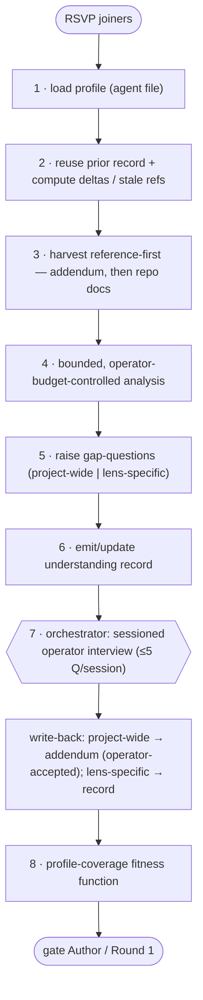

# Chorus Exploratory Phase

The **single canonical definition** of how a participating advisor builds and
persists a lens-specific *understanding* of the review target **before** it
authors findings. Both modes reference this file: the project-state round
(`INTEGRATION-LAYER.md`) runs it between Phase 0.5 (RSVP) and Phase 1 (Round 1);
the SDLC gates (`SDLC-LAYER.md`) run it before a gate's Author stage
(`GATE-PRIMITIVE.md` stage 2). There is exactly one copy; neither layer restates
the mechanic.

The phase removes the per-round **cold read**: findings rest on a real,
persisted understanding rather than whatever an advisor happened to read that
round, and the next round reuses that understanding instead of re-deriving it.
It is **upstream of** the gate primitive — it produces persistent per-lens
understanding; the primitive's Stage 1 Extract still gathers per-review
finding-records. The exploratory record *feeds* Extract; it does not replace it.

Steps run **cheapest-subset-first** (FR-020): profiles + reference harvest + one
interview session before any optional deeper analysis, so the phase shows value
before more of the operator's budget is spent. The per-round cost is
operator-controlled (FR-019).

## Procedure

### Per advisor (RSVP joiners only — abstainers skip the phase, FR-013)

1. **Load profile** — the lens's `## Information needs (exploratory phase)`
   section from its agent file (`agents/<persona>.md`).
2. **Reuse** — load the advisor's prior understanding record; compute the round
   deltas (the round-context paragraph the chorus already builds) and any stale
   references. Needs already satisfied and untouched are carried forward
   untouched (FR-010).
3. **Harvest (reference-first)** — for each unmet/affected need, search existing
   written knowledge **addendum-first** (`docs/reviews/CHORUS-PROJECT.md`), then
   docs / ADRs / READMEs / specs / diagrams / comments. Record a **reference**
   (a locator), not a copy (FR-003/FR-004).
4. **Analyse (bounded)** — for needs the repo doesn't answer, run a bounded,
   **operator-budget-controlled** analysis (the chorus's sampling discipline; no
   enumerate-everything). Record results as **inferred** (provisional, FR-006/011).
5. **Raise gap-questions** — for needs neither reference nor analysis settled,
   emit gap-questions tagged `project-wide` or `lens-specific`. Do **not**
   interview the operator directly (FR-007).
6. **Emit record** — write/update the per-advisor understanding record
   (referenced / inferred / operator-confirmed entries + cached project-wide
   facts + open gaps + dates).

### Orchestrator (once per round)

7. **Sessioned interview** — collect gap-questions across all joiners, dedupe
   semantically-equivalent ones, and run **one** operator interview delivered in
   **sessions of ≤ 5 questions** (see *Sessioned interview* below). Route
   answers: `project-wide` → addendum write-back (operator-accepted);
   `lens-specific` → the asking advisor's record.
8. **Coverage check** — run the profile-coverage fitness function (below);
   report pass/fail per advisor before findings are authored.

## Two-tier memory

- **Project base = the addendum** (`docs/reviews/CHORUS-PROJECT.md`) — shared,
  operator-owned, and the **authoritative system of record** for project-wide
  facts. A deliberately **limited surface**: advisors are not forced to read it
  in full each round. It gains a structured **"Project understanding"** section
  (schema in `specs/004-advisor-exploratory-phase/contracts/addendum-project-understanding.md`).
- **Lens layer = per-advisor record** in the advisor's memory
  (`~/.claude/agent-memory/<persona>/`) — references (incl. into the addendum),
  inferences, gaps, and **cached** project-wide facts; split into a
  project-scoped part and feature/spec deltas (FR-014/FR-016).

**Denormalization is allowed and deliberate (FR-023).** A record MAY cache the
project-wide facts its lens uses, so a **directly-invoked** advisor need not read
the addendum. Each cached copy carries a **reconciliation locator + freshness
fingerprint** back to its addendum source. Consistency is **weak/eventual**: on
fingerprint drift the cached copy is re-validated against the addendum, which is
**authoritative on conflict**.

**Confirmed-fact scope.** Every operator-confirmed fact carries a `scope`
(`project-wide` | `lens-specific`). Only `project-wide` facts are *authored* in
the addendum, and the **only** write-direction into the operator-owned addendum
is the scope-tagged, operator-accepted write-back (FR-005/FR-017). A record copy
is a cache, never an author.

## Memory is an index, never the evidentiary endpoint

Persisted memory — per-advisor records and cached addendum facts — is an **index
of locators**. A finding's evidence **re-grounds in the live material** via the
locator (the founding why-why-why chain, applied fully); a persisted quote
(≤ ~2 sentences) is a **navigational hint only, never the endpoint** of an
evidence chain (FR-021/FR-004). This keeps persisted text non-authoritative —
closing the harvest-to-replay trust surface (a reviewed repo's prose cannot
inject a trusted payload into a later round) and catching staleness at re-read,
because the live source is always the authority for a finding.

## Staleness & reconciliation

A **source reference** records a locator (path + section/anchor or `file:line`),
the date recorded, and a **freshness fingerprint**. On reuse, a changed
fingerprint flags the reference **stale**; it is re-validated (re-read) before
trust, and — for a cached project-wide fact — reconciled against the
authoritative addendum (FR-012/FR-023).

**Fingerprint granularity (decision — resolves Gate A residual R2).** The
fingerprint is a **short content digest of the referenced span** (the section/
anchor or line range actually cited), not the file's mtime and not a whole-repo
commit hash:

- *mtime* is rejected — it changes without content change (false-stale) and can
  fail to change when content does under some tooling (false-fresh); false-fresh
  is the dangerous direction.
- *whole-file commit marker* is rejected as the primary signal — an unrelated
  edit elsewhere in a large doc would false-stale every reference into it.
- *content digest of the cited span* changes **iff** the cited content changes —
  the property staleness detection actually needs. For a whole-file reference the
  span is the file; for a cached addendum fact the span is the fact's line(s).

**Executor (this skill has no runtime).** There is no build step computing hashes:
the freshness check is performed by **the advisor re-reading the cited span** and
comparing it to what the record captured — the "digest" is that **content
comparison at re-read**, not a stored cryptographic hash. Where a real hash *is*
cheaply available (e.g. a git blob hash for a committed file) it MAY be recorded as
a fast pre-filter, but the advisor's re-read of the span is the authority. Either
way it is a cheap, bounded compare, not a re-exploration — and because re-grounding
already re-reads the source (memory is an index, never the endpoint), the freshness
check rides on a read the advisor was going to do anyway.

## Incremental deltas

On a later round the advisor re-examines **only** the needs touched by the
round-context deltas (commits / specs / infra / incidents since the last round)
and any references whose fingerprint drifted; everything else is reused from the
record (FR-010). The phase reuses the delta paragraph the chorus already
computes — the cheapest correct incrementality.

## Sessioned interview

The batched operator interview is **not** one wall of questions. It is:

- **Sessions of ≤ 5 questions** each.
- **Re-entrant** — the operator may **defer** a session and **resume** it later;
  session state (answered / deferred / pending) persists.
- **Operator-paced** — the operator controls how much token/time budget the phase
  spends; they decide when to stop and when to continue.
- **Educational** — each session opens with a short plain-language preamble (what
  this is, what it costs, that it can be paused) written for an operator who has
  **not** read the chorus docs — **full** on the first session, a **brief
  resumed-context reminder** on later ones.

**Degradation summary.** If the operator leaves the interview before it
completes, the unanswered needs stay **open gaps** (provisional), and the round's
verdict carries an explicit **degradation summary** — how many gaps remain and
which findings are affected — so a skipped interview is an *informed* trade-off,
never a silent quality drop (FR-019/SC-009).

The question pool is bounded by genuine gaps (reference-harvest + bounded
analysis + dedupe + the "don't ask what the repo already answers" rule run
first), so sessions **partition a finite pool** — they do not generate an
open-ended interview.

## Profile-coverage fitness function

The phase's conformance check (FR-022 / SC-010). It is **runnable once the
exploratory phase has produced understanding records** — it checks the records the
phase emits, not an empty tree — run per advisor after the interview and before
findings are authored:

1. **Coverage** — every item in the lens's information-needs profile resolves to
   an entry in its understanding record, tagged `referenced` / `inferred` /
   `operator-confirmed` / `open-gap`. A profile item with **no** record entry is
   a detectable **coverage failure**, not a matter of interpretation.
2. **Reconciliation** — every cached `project-wide` fact carries a reconciliation
   locator to the addendum.

Two tiers of check (see `quickstart.md`): the **structural smoke checks**
(profile-section present, both modes reference this doc, template carries the
section) run **always**, against the repo as-is, with no records needed; the
**coverage** check above is the per-advisor part that runs against the records a
round produces. Calling the whole thing "executable" only means *coverage is
mechanically decidable once records exist* — not that it runs on an empty tree.
Together they replace prose-only conformance for SC-001 / SC-003 / SC-005 /
SC-007 / SC-008.

## Invariants this phase carries

- The phase runs for **RSVP joiners only**; abstainers do not explore (FR-013).
- Findings produced afterward **trace to the record and re-ground in the live
  source** — persisted memory is never a finding's endpoint (FR-021 / SC-001).
- **Reference, don't duplicate**: no source is reproduced beyond a short hint
  quote (FR-004 / SC-002).
- The **orchestrator owns operator interaction** — advisors never interview
  directly; one batched (possibly multi-session) interview per round (FR-007).
- The **addendum stays operator-authoritative** — only operator-accepted,
  scope-tagged write-backs land; caches reconcile to it (FR-017 / FR-023 / SC-008).
- A **conflict between sources** is recorded as a gap/drift and surfaced, not
  silently resolved (FR-015).

## Adoption note

`INTEGRATION-LAYER.md` (base round) and `SDLC-LAYER.md` (gates A/B/C) **reference
this file** for the mechanic; they do not restate it. Any change to the phase
happens here, once, so the two modes cannot drift.

## Provenance

Specified in `specs/004-advisor-exploratory-phase/` (spec FR-001..FR-023, research
D1–D12, `data-model.md`, `contracts/`, `quickstart.md`). The sessioning,
memory-as-index, authoritative-addendum-plus-cache, and profile-coverage
fitness-function refinements come from the **Gate A** design review
(`agent-sdlc-log.md`, cycle 2). The per-lens profiles were nominated by the
advisors themselves and seeded from `information-needs-profiles.md`.
