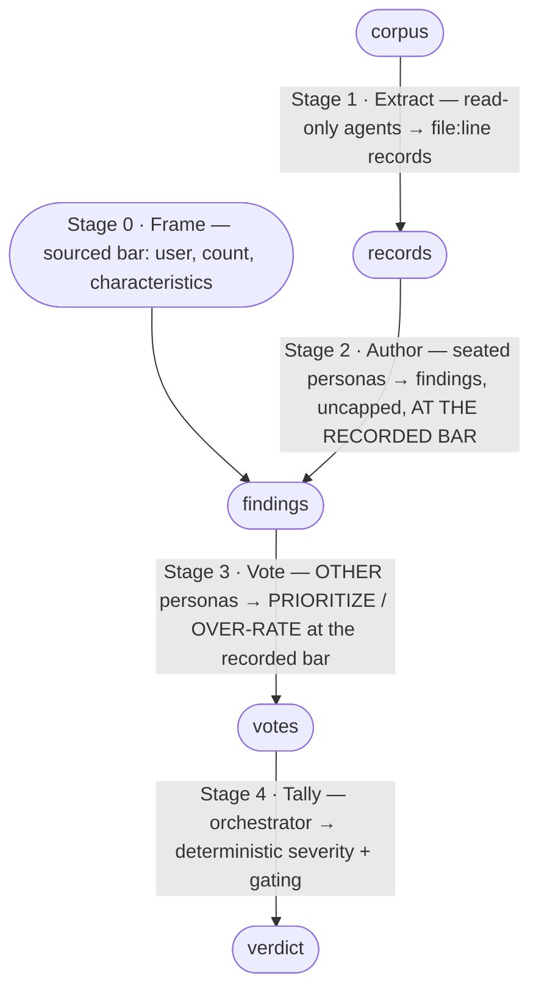

# Chorus Gate Primitive

This is the **single canonical definition** of how a chorus conducts one review.
Both the periodic project-state round (`INTEGRATION-LAYER.md`, Phases 1/2/4) and
the per-feature SDLC gates (`SDLC-LAYER.md`, Gates A/B/C) run *this* mechanic.
There is exactly one copy; neither layer restates it.

A review is a **frame check** (Stage 0) followed by four **separable,
specialized stages**, each with a distinct actor and a distinct success
criterion. Running them blended is the failure mode this
file exists to prevent: a 2026-06-06 back-test of the constraint-and-flow lens
showed that when one agent both **authored and graded** findings it ranked the
new lens dead last; when authoring was split from a **real adversarial vote** the
same lens came back mid-pack. Stage separation changed the answer. The stage you
cheap out on is the stage that lies to you — and stage 3 is load-bearing.



## Stage 0 — Frame (precondition to Author)

A review graded against the wrong bar is wrong in every finding at once, and the
later stages **amplify** rather than catch it: every vote asks "is this severe
*within the frame*," so convergent PRIORITIZE escalates production-bar findings
on a dev tool just as faithfully as real ones. A per-finding vote cannot see an
altitude error — only a frame stated *before* authoring can. (Provenance: a
2026-06-11 gate manufactured 13 gating 🔴 against an unexamined production bar on
single-operator dev tooling; the operator overrode the entire set with one
reframe. Issue #6.)

- **Actor**: jointly the **product + architecture + scope** lenses among the
  seated panel (any seated lens may contribute); the orchestrator records.
- **Output**: the **frame record**, three answers:

  | Question | Answer records |
  |---|---|
  | Who is the user, and how many? | named user(s) + count (one operator / a team / external customers) |
  | Which characteristics does the artifact need? | ranked top 3–7 (simplicity/portability are characteristics too) |
  | What bar are findings graded against? | production service · internal tooling · disposable experiment |

- **Sourcing**: each answer carries its provenance — **spec/addendum reference
  or operator confirmation only, never inference**. Frame inputs are operator
  intent, not artifact-derivable; on a greenfield buildout there is nothing to
  infer *from*. Unstated answers become **frame questions that lead the first
  operator-interview session** (`EXPLORATORY-PHASE.md`); if the operator defers
  them, the frame is recorded as **provisional** and the verdict carries that
  degradation banner — a provisional-frame 🔴 is an operator question, not a
  block.
- **Consumption**: every Stage 2 author brief **embeds the frame record**, and
  findings are proposed at the recorded bar (a finding that blocks at a
  production bar may be a 🟢 nicety at an internal-tooling bar — the brief says
  which applies). Stage 3 votes severity *at the recorded bar*.
- **Frame challenge**: a persona that believes the frame itself is wrong files a
  **frame objection routed to the frame record** (surfaced to the operator),
  never a severity-graded finding — a frame fact filed as a 🟡 defect is
  flattened by the vote into a nitpick, which is precisely the failure this
  stage exists to prevent.
- **Must not**: be skipped, inferred by the orchestrator, or answered by the
  spec's own self-description when a lens's evidence contradicts it (the
  contradiction routes to the operator).

## Stage 1 — Extract

- **Actor**: read-only `Explore` / general-purpose agents, in parallel.
- **Input**: the review corpus (for the base round, the artefacts named in the
  brief; for an SDLC gate, the gate's corpus per `SDLC-LAYER.md`).
- **Output**: structured **extract records** — one factual observation each:

  ```
  {
    "artifact":       "<path>",
    "location":       "<file>:<line>" | "<file>:<lineStart>-<lineEnd>",
    "observation":    "<one factual sentence, no judgment>",
    "raw_excerpt":    "<verbatim quote>",
    "candidate_lens": "<lens this most concerns>" | "unassigned",
    "source":         "explore" | "spec-walkthrough"
  }
  ```

- **Success criterion**: coverage of the corpus; every record carries a real
  `file:line` anchor. These anchors are what later satisfy the I8 evidence gate.
- **Must not**: assign severity or author findings (that is stages 2–4).
- **Fixed viewpoint (SDLC Gate C only)**: the headless `spec-walkthrough` digest
  (`Skill(skill: "spec-walkthrough", args: "<NNN> headless")`) is ingested as
  records with `source: "spec-walkthrough"`. It is **not authoritative** — a
  persona must author a record into a finding for it to face the vote; any
  DRIFT/SURPRISE no persona claims is logged as an unclaimed record (visible,
  non-gating). See `SDLC-LAYER.md`.

## Stage 2 — Author

- **Actor**: the seated persona itself, one per lens (in the base round, the
  Round-1 agent; in an SDLC gate, the gate's seated panel).
- **Input**: the **frame record** (Stage 0, embedded in the brief), the extract
  records, plus the persona's own reading of the corpus.
- **Output**: **findings**, each:
  `{id, lens, evidence (file:line | [principle] | [principle:proposed]),
  proposed_severity (🔴/🟡/🟢), summary (≤ 20 words)}`.
- **Success criterion**: **uncapped**. The finding count is whatever the corpus
  honestly warrants — there is **no per-author target or quota** (no "3–6", no
  "limit to N"). A word limit, where one exists, bounds the *prose density per
  finding*, never the *number of findings*.
- **Must not**: pad to hit a number; file a project-specific claim with no
  `file:line` and no principle tag (such a finding is demoted to
  `[unsupported]` per I8 and excluded from the tally).

## Stage 3 — Vote

- **Actor**: the **real** seated personas, in character — **never** the author of
  the finding, **never** a synthetic grader (S8, S9). In the base round this is
  the Phase-2 cross-evaluation; in an SDLC gate it is the gate's vote stage.
- **Input**: the findings register.
- **Output**: per non-author persona, one **vote** on each finding it has a view
  on: `PRIORITIZE` (this is at least as severe as the author proposed) or
  `OVER-RATE` (less severe than proposed), with optional rationale. Abstention on
  a finding is allowed.
- **Success criterion**: adversarial and real — each vote traces to a dispatched
  persona, and no finding is voted on by its own author.
- **Must not**: be predicted, inferred, or summarized by the orchestrator. A
  *predicted* reaction is not a vote.

## Stage 4 — Tally

- **Actor**: the orchestrator, deterministic.
- **Input**: the votes.
- **Output**: each finding's **post-tally severity** and **gating flag**, by the
  fixed **symmetric** rule. Let `P` = PRIORITIZE count and `O` = OVER-RATE count
  among **non-author** voters, and `net = P − O`:

  | Condition | Effect |
  |---|---|
  | `net ≥ +2` | escalate one level (🟢→🟡→🔴, capped at 🔴) |
  | `net ≤ −2` | demote one level (🔴→🟡→🟢, 🟢→drop) |
  | `\|net\| < 2` | hold author-proposed severity |

  - `net = 0` from all-abstain holds and is marked **unvoted** (non-gating,
    surfaced).
  - Movement is **one level per tally**, regardless of margin (a 4–0 OVER-RATE
    demotes 🔴→🟡, not to nothing — the finding survives in the record).
  - A finding is **gating** iff its post-tally severity is 🔴 — full stop. No
    additional judgment clause: the vote is the confirmation.
- **Success criterion**: arithmetic only — no judgment added. Identical votes
  always yield identical severities; there are **no tally ties**. (Operator
  tie-breaking exists only for SDLC cap-5 *seating*, never in the tally.)
- **Must not**: re-weight by lens, author, or orchestrator preference; add a
  judgment clause to the gating decision.

Symmetry is deliberate. It encodes the long-standing chorus rule that **two
lenses converging on a concern earn 🔴** (README): convergent PRIORITIZE escalates
just as clear OVER-RATE demotes. A demote-only tally would silently let an
author-under-rated finding through.

## Invariants this primitive carries

These bind every review — the base round and every SDLC gate. They extend the
integration layer's I1–I8.

- **S8.** The author of a finding is never its grader. Stage 3 dispatches to
  personas *other than* the author; a persona never votes on its own finding.
  (The back-test failure mode: author-grades-self buried the new lens last.)
- **S9.** The orchestrator never synthesizes a vote or a grade. Stage 3 is a real
  dispatch to seated personas; stage 4 aggregates real votes only. A predicted
  reaction is not a vote. (Extends I1/I6 to the voting and tally stages.)
- **S10.** No findings are authored without a frame record (Stage 0). Frame
  inputs resolve only as *referenced* or *operator-confirmed* — never *inferred*.
  A frame fact discovered at any stage routes to the frame record as a frame
  objection, never into the findings register as a severity-graded defect.

## Adoption note

`INTEGRATION-LAYER.md` (base round Phases 1/2/4) and `SDLC-LAYER.md` (gates
A/B/C) **reference this file** for the mechanic; they do not restate it. Any
change to frame/extract/author/vote/tally happens here, once, so the two modes
cannot drift. The lifecycle-specific invariants S1–S7 live in `SDLC-LAYER.md`;
the gate-primitive invariants S8–S10 live here because they bind both modes.

## Provenance

Designed in `docs/superpowers/specs/2026-06-06-agent-sdlc-workflow-design.md`
and specified in `specs/003-agent-sdlc-workflow/` (see
`contracts/gate-primitive.md` and `contracts/sdlc-invariants.md`). The
stage-separation rule and S8/S9 come from a 2026-06-06 back-test of the
constraint-and-flow lens.
