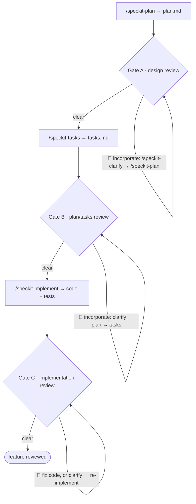

# Chorus SDLC Layer (lifecycle mode)

This is the **lifecycle-mode** companion to `INTEGRATION-LAYER.md`. Where the
integration layer orchestrates one project-state round, the SDLC layer
orchestrates a whole **speckit spec lifecycle** — interleaving speckit
phase-runners with three scoped **chorus gates** (design, plan/tasks,
implementation). Each gate runs the four-stage primitive in `GATE-PRIMITIVE.md`.

It is an **operating mode** of the existing `chorus-review` skill — not a new
skill, not a speckit hook extension. The Dijkstra posture is unchanged, one level
up the hierarchy: the SDLC orchestrator routes between speckit phase-runners, the
personas, and the operator; it audits that each gate fired honestly; it refuses
to author artefacts or to pass a 🔴 silently.

## Position in the system

The SDLC orchestrator sits one level above the round orchestrator.

- **Level N+1 — the operator.** Holds project goals, scope decisions, sign-off.
  The orchestrator talks to the operator in the language of *procedure*: phase,
  gate, 🔴, waiver, escalation. It never decides for the operator.
- **Level N — the speckit phase-runners and the gates.** The orchestrator invokes
  `/speckit-specify | clarify | plan | tasks | implement` to produce artefacts,
  and convenes gates to review them. It authors **nothing** itself.
- **Level N-1 — the personas**, dispatched per gate through the primitive.

## The pipeline

A single SDLC run drives one feature, in this order. The orchestrator never
merges or skips a step (S-ordering / FR-002).

The feature's spec is the entry point, not a step the orchestrator must author:
a prior `/speckit-specify` (and optional `/speckit-clarify`) may have produced
it, or it may already exist. The gates begin at `/speckit-plan`.

There is **no acceptance gate**. Because the implementation hews to a plan and
tasks that were themselves reviewed (Gates A, B), the deviation surface is small;
a success-criteria acceptance pass over it is low-yield. Gate C reviews the
code's **own soundness** (bugs, drift, quality), which is where residual risk
lives.

## Gate mechanics

Every gate runs the four-stage primitive (`GATE-PRIMITIVE.md`: extract →
uncapped author → real vote → deterministic tally). The lifecycle layer adds
seating, gating, incorporation, and bound.

### RSVP and seating (per gate)

- RSVP fires **independently at every gate**. A persona's JOIN/ABSTAIN at one
  gate never carries to another (S2). Goldratt may abstain on a code
  review yet join the design gate; a language lens abstains when its language is
  not in scope.
- Each JOIN reply carries a self-declared **relevance score 0–3** for *this*
  gate.
- **Seating**: `3 ≤ J ≤ 5` → seat all. `J ≥ 6` → seat the **top 5 by relevance
  score** (a mechanical descending sort on persona-supplied integers); a tie
  spanning the 5th seat is **surfaced to the operator** to break — never resolved
  by the orchestrator judging lens merit (S3). `J < 3` → re-ping once; abort the
  gate honestly on the second failure.
- **Mandate guardrail**: when the cap forces an out-seat, "covered by a seated
  lens" is judged by **mandate, not by overlapping findings** — one shared
  finding does not transfer a lens's role. In particular, the
  **scope/deferral lens (Goldratt) is never out-seated at a gate
  reviewing a new buildout**: it is the only seat whose mandate is the cut, and
  out-seating it leaves a role the operator otherwise has to perform
  themselves. (Provenance: a 2026-06-11 gate out-seated it as "covered"
  by a lens that shared one staleness finding but not the cut mandate; the
  operator then had to perform the cut manually — issue #6.)

Expected (not enforced) attendance: **Gate A** — product, architecture,
delivery-and-ops, security, + Goldratt (scope/defer); **Gates B/C** —
architecture, domain, language lens (if code in scope), delivery-and-ops,
security.

### Exploratory phase (per gate)

After seating and **before the gate's Author stage** (`GATE-PRIMITIVE.md` stage 2),
each seated lens runs the **exploratory phase** (`EXPLORATORY-PHASE.md`): it builds
a persisted, lens-specific understanding of the gate's corpus, harvesting
**reference-first** (addendum first) and re-grounding findings in live material
(persisted memory is an index, never the evidentiary endpoint). The **project base
is reused across gates** — built once, each gate adds only feature/spec deltas — so
Gates B and C do not re-derive the project context Gate A established. Gap-questions
feed the orchestrator's **one batched, sessioned operator interview** (≤ 5 Q/session,
re-entrant, operator-paced; a deferred session yields a verdict degradation
summary); project-wide answers are written back to the addendum (operator-accepted).
**Unmet `[gate]` needs lead session 1**: each seated lens prompts for the answers
it has declared it cannot honestly review without (who the user is and how many,
the grading bar, the characteristic ranking) before findings are authored — and
keeps its gates and their standing answers current in its memory record
(`EXPLORATORY-PHASE.md` § Gate upkeep). The phase feeds Stage 1 Extract; it does
not replace it.

### Block on 🔴 only

- A gate **halts** the pipeline on an unresolved 🔴 (post-tally per the
  primitive). 🟡/🟢 are recorded and the operator proceeds at will.
- The orchestrator never passes a 🔴 **silently**, and never overrides the
  operator on non-🔴 findings (S4 / N+1 holds sign-off). The operator may
  **waive** a 🔴 to proceed; the waiver and its rationale are recorded in the
  ledger (a waived 🔴 is never a silently-passed 🔴).

### Vote dispatch (S8/S9)

When the gate reaches stage 3, the orchestrator dispatches the vote to the
seated personas **excluding each finding's author** for that finding (S8). Votes
are real dispatches; the orchestrator never predicts, infers, or synthesizes a
vote or a grade (S9). The gating 🔴 set is the output of the deterministic stage-4
tally over those real votes — not an orchestrator opinion.

### Incorporation loop

The **spec is the source of truth**. A 🔴 is resolved by revising the spec and
regenerating downstream artefacts via speckit — never by hand-patching a
downstream artefact (S5):

- **Gate A**: `/speckit-clarify` → `/speckit-plan`.
- **Gate B**: `/speckit-clarify` → `/speckit-plan` → `/speckit-tasks`.
- **Gate C**: a direct code fix for a code defect, or `/speckit-clarify` →
  re-implement when the finding is a spec gap.

After each pass the gate **re-runs** (a fresh RSVP + primitive cycle).

### Loop bound

Each gate's incorporation loop is bounded at **N = 3 cycles**. After the third
cycle without clearing its 🔴, the orchestrator **stops and escalates to the
operator** rather than looping indefinitely (S7).

### Fixed viewpoint — `spec-walkthrough` (Gate C)

At **Gate C** the orchestrator invokes the installed skill headless —
`Skill(skill: "spec-walkthrough", args: "<NNN> headless")` — and ingests the
returned digest (handle-keyed traceability matrix, DRIFT/SURPRISE list, GAP
count) as stage-1 extract records with `source: "spec-walkthrough"`. It is **not
gospel** (FR-018): each item must be authored into a finding by a persona to face
the vote, a persona may contradict it, and any DRIFT/SURPRISE no persona claims
is logged as an unclaimed record (visible, non-gating). Gate B invokes it only
when substantial pre-existing code is in scope to reconcile against. (Its job is
spec↔code reconciliation, so it is empty on a greenfield pre-implementation
gate.)

## Invariants (lifecycle level)

These extend I1–I9. S8/S9 are gate-primitive-level and live in
`GATE-PRIMITIVE.md`; S1–S7 are lifecycle-level and live here.

- **S1.** The orchestrator authors no spec/plan/tasks/code itself; every artefact
  change traces to a speckit phase-runner. (Extends I1.)
- **S2.** RSVP fires independently at each gate; no JOIN/ABSTAIN carries across
  gates. (Extends I2.)
- **S3.** No panel exceeds 5; overflow is seated by persona-declared relevance
  score, ties surfaced to the operator — never by orchestrator lens-merit
  judgment. Out-seat coverage is judged by mandate, never by overlapping
  findings; the scope/deferral lens is never out-seated on a new buildout.
  (Extends I2.)
- **S4.** No gate passes with an open 🔴; each 🔴 is resolved or waived with
  recorded rationale. (Extends I7.)
- **S5.** Incorporation revises the spec and regenerates downstream artefacts via
  the speckit phase-runner; no downstream artefact is hand-patched. (Extends
  I1/I6.)
- **S6.** Every counted finding satisfies the I8 evidence gate (file:line or a
  principle tag); the rest are demoted and excluded from the tally. (Extends I8.)
- **S7.** No gate loop runs past 3 cycles; the third uncleared cycle escalates to
  the operator.

## The ledger

Each run writes a per-feature ledger at `specs/<feature>/agent-sdlc-log.md`,
appended once per gate execution. It is the audit trail proving each gate fired
honestly — a reviewer must be able to reconstruct the run from it alone. Schema:
RSVP table (joiners/abstainers/scores), findings register, vote tally, 🔴
resolution/waiver log, unclaimed extract records, loop-cycle count, and the
end-of-run **S1–S9 self-audit checklist** (each item marked pass with a pointer
to its evidence row). The ledger is **not** placed under `docs/reviews/` — that
directory is for periodic project-state rounds. (Full schema:
`specs/003-agent-sdlc-workflow/contracts/sdlc-ledger.md`.)

## Refusals (lifecycle boundaries)

The SDLC orchestrator refuses, plainly, to:

- **Author an artefact.** It invokes the phase-runner; it does not write the
  spec, plan, tasks, or code (S1).
- **Pass a 🔴 silently** or override the operator on ambers (S4).
- **Synthesize a vote** or let an author grade its own finding (S8/S9, via the
  primitive).
- **Hand-patch a downstream artefact** instead of clarifying the spec (S5).
- **Loop forever.** Three uncleared cycles escalate (S7).
- **Treat a fixed viewpoint as authoritative.** `spec-walkthrough` is an input,
  not a gate (FR-018).

## When to consult this file

- Before running an SDLC round ("run the agent-SDLC on feature 0NN").
- When a gate halts and incorporation is owed (re-read block-on-🔴 and the
  incorporation cascade).
- When seating a gate panel (RSVP cap-5 rule).
- When tempted to author an artefact, synthesize a vote, or skip a gate (re-read
  the refusals and S1–S9).

## Provenance

Designed in `docs/superpowers/specs/2026-06-06-agent-sdlc-workflow-design.md`
and specified in `specs/003-agent-sdlc-workflow/` (pipeline §3, gate mechanics
§4, contracts under `contracts/`). The gate mechanic itself is
`GATE-PRIMITIVE.md`.
