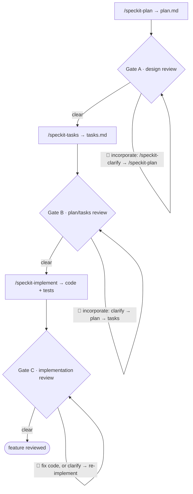

# Chorus SDLC (lifecycle mode)

This skill is the **lifecycle-mode** member of the chorus suite. Where the
project-state round (`chorus-review`) orchestrates one review of a chosen scope,
this skill orchestrates a whole **speckit spec lifecycle** — interleaving speckit
phase-runners with three scoped **chorus gates** (design, plan/tasks,
implementation). Each gate runs the four-stage primitive in
`chorus-core/GATE-PRIMITIVE.md`.

It composes the shared substrate skill **`chorus-core`** by name and is
**independent of `chorus-review`** — it shares no file with the review skill and
no reference here resolves into it (FR-006). The Dijkstra posture is the
substrate's, applied one level up the hierarchy: the SDLC orchestrator routes
between speckit phase-runners, the personas, and the operator; it audits that
each gate fired honestly; it refuses to author artefacts or to pass a 🔴
silently.

## REQUIRED: chorus-core — substrate guard (run BEFORE anything else)

This skill composes **`chorus-core`**. Before relying on **any** core mechanic —
the four-stage gate (`GATE-PRIMITIVE.md`), the decision banding
(`DECISION-PRIMITIVE.md`), the exploratory phase (`EXPLORATORY-PHASE.md`), or the
conductor discipline + `I1–I9` invariant catalog (`CONDUCTOR.md`) — the calling
session MUST assert that the `chorus-core` skill directory is reachable (its four
files are present).

The skill loader does **not** enforce the `REQUIRED:` marker (it is advisory), so
this assertion is the real enforcement. **If `chorus-core` is not reachable, STOP
and fail loudly** — do not improvise the missing mechanics, do not degrade
silently. Emit:

> **chorus-core is missing.** `chorus-sdlc` requires the shared substrate skill
> `chorus-core`, which is not reachable. This means a broken or partial install of
> the chorus suite — the shared mechanics (the four-stage gate, decision banding,
> exploratory phase, and the `I1–I9` invariant catalog) cannot be loaded, so the
> lifecycle gates cannot run honestly. **Recovery:** re-install the chorus suite
> (`./install.sh`), or check that `chorus-core` was published/copied under its
> expected name, then retry.

When `chorus-core` is reachable, its router (`chorus-core/SKILL.md`) runs its own
reachability self-check over the four files (defense-in-depth for the
file-missing case). This guard does **not** reference `chorus-review` in any way;
the lifecycle runs with the review skill absent.

## Position in the system

The SDLC orchestrator sits one level above the round orchestrator.

- **Level N+1 — the operator.** Holds project goals, scope decisions, sign-off.
  The orchestrator talks to the operator in the language of *procedure*: phase,
  gate, 🔴, waiver, escalation. It never decides for the operator.
- **Level N — the speckit phase-runners and the gates.** The orchestrator invokes
  `/speckit-specify | clarify | plan | tasks | implement` to produce artefacts,
  and convenes gates to review them. It authors **nothing** itself.
- **Level N-1 — the personas**, dispatched per gate through the primitive.

## The pipeline

A single SDLC run drives one feature, in this order. The orchestrator never
merges or skips a step (S-ordering / FR-002).

The feature's spec is the entry point, not a step the orchestrator must author:
a prior `/speckit-specify` (and optional `/speckit-clarify`) may have produced
it, or it may already exist. The gates begin at `/speckit-plan`.

There is **no acceptance gate**. Because the implementation hews to a plan and
tasks that were themselves reviewed (Gates A, B), the deviation surface is small;
a success-criteria acceptance pass over it is low-yield. Gate C reviews the
code's **own soundness** (bugs, drift, quality), which is where residual risk
lives.

## Gate mechanics

Every gate runs the four-stage primitive (`chorus-core/GATE-PRIMITIVE.md`:
extract → uncapped author → real vote → deterministic tally). The lifecycle layer
adds seating, gating, incorporation, and bound.

**Operator-facing decisions** in this layer — seating, block-on-🔴, gate sign-off —
are banded by the **decision primitive** (`chorus-core/DECISION-PRIMITIVE.md`: 🟢
auto-resolve / 🟡 proceed-with-recorded-default + async override / 🔴 hard-block +
instant ask, by **declared catalog predicate**, never orchestrator inference). The
sections below reference that mechanic; they do not restate it. The point is a
**self-unblocking yet balanced** lifecycle: the workflow runs forward, stopping the
operator only for 🔴.

### RSVP and seating (per gate)

- RSVP fires **independently at every gate**. A persona's JOIN/ABSTAIN at one
  gate never carries to another (S2). Goldratt may abstain on a code
  review yet join the design gate; a language lens abstains when its language is
  not in scope.
- Each JOIN reply carries the **two-axis signal** (`chorus-core/DECISION-PRIMITIVE.md`
  §RSVP signal): **applicability** (≥1 cited round-context delta the lens touches; an
  un-cited JOIN is not-applicable) and **expected stakes** (🟢/🟡/🔴-potential + a
  hook). This replaces the old single relevance 0–3 score, which degenerated to
  all-3s.
- **Seating** is a *decision* banded by `chorus-core/DECISION-PRIMITIVE.md` (catalog
  rows 1–2): `3 ≤ J ≤ 5` → seat all. `J ≥ 6` → sort by (applicability, then expected
  stakes); a **strict** order at the 5th seat is 🟢 (auto-seat). A **tie** spanning the
  5th seat is **🟡** — seat a recorded default panel and queue it for async override,
  **never an operator interruption** (this is the seating tie that parked feature 005
  tried, and failed, to resolve mechanically; as a 🟡 it self-unblocks). `J < 3` →
  re-ping once; abort the gate honestly on the second failure. The orchestrator still
  never judges lens merit (S3/D1) — it sorts persona-supplied evidence and applies a
  declared band.
- **Mandate guardrail**: when the cap forces an out-seat, "covered by a seated
  lens" is judged by **mandate, not by overlapping findings** — one shared
  finding does not transfer a lens's role. In particular, the
  **scope/deferral lens (Goldratt) is never out-seated at a gate
  reviewing a new buildout**: it is the only seat whose mandate is the cut, and
  out-seating it leaves a role the operator otherwise has to perform
  themselves. (Provenance: a 2026-06-11 gate out-seated it as "covered"
  by a lens that shared one staleness finding but not the cut mandate; the
  operator then had to perform the cut manually — issue #6.)

Expected (not enforced) attendance: **Gate A** — product, architecture,
delivery-and-ops, security, + Goldratt (scope/defer); **Gates B/C** —
architecture, domain, language lens (if code in scope), delivery-and-ops,
security.

### Exploratory phase (per gate)

After seating and **before the gate's Author stage** (`chorus-core/GATE-PRIMITIVE.md`
stage 2), each seated lens runs the **exploratory phase**
(`chorus-core/EXPLORATORY-PHASE.md`): it builds a persisted, lens-specific
understanding of the gate's corpus, harvesting **reference-first** (addendum first)
and re-grounding findings in live material (persisted memory is an index, never the
evidentiary endpoint). The **project base is reused across gates** — built once, each
gate adds only feature/spec deltas — so Gates B and C do not re-derive the project
context Gate A established. Gap-questions feed the orchestrator's **one batched,
sessioned operator interview** (≤ 5 Q/session, re-entrant, operator-paced; a deferred
session yields a verdict degradation summary); project-wide answers are written back
to the addendum (operator-accepted). **Unmet `[gate]` needs lead session 1**: each
seated lens prompts for the answers it has declared it cannot honestly review without
(who the user is and how many, the grading bar, the characteristic ranking) before
findings are authored — and keeps its gates and their standing answers current in its
memory record (`chorus-core/EXPLORATORY-PHASE.md` § Gate upkeep). The phase feeds
Stage 1 Extract; it does not replace it.

### Block on 🔴 — via the self-heal loop

A post-tally gating 🔴 is a **decision** banded by `chorus-core/DECISION-PRIMITIVE.md`
(catalog row 5, the self-heal loop):

- While `cycle < 3` it is a **🟡 decision**: the orchestrator **auto-runs the
  incorporation cascade and re-runs the gate** (the re-run tally is the verifying
  sensor — "verify before you ask"), emitting an `in-progress` DecisionRecord **before
  each next cycle** so an in-flight self-heal reads as progress, not runaway.
- It **escalates to a 🔴 operator ask** at `cycle == 3` without clearing, **or** when a
  **waiver** of a real concern is the only path. A waiver is never applied
  automatically; 🔴 never auto-proceeds (D2).
- 🟡/🟢 findings are recorded; the operator proceeds at will. N+1 holds sign-off (S4).
- This stays inside the existing guarantees: **S4** (the 🔴 is *resolved and verified*,
  never passed silently), **S5** (spec-sourced incorporation), **S7** (the 3-cycle
  bound is the escalation trigger). It just stops asking the operator to push the
  incorporate button each cycle.

### Vote dispatch (S8/S9)

When the gate reaches stage 3, the orchestrator dispatches the vote to the
seated personas **excluding each finding's author** for that finding (S8). Votes
are real dispatches; the orchestrator never predicts, infers, or synthesizes a
vote or a grade (S9). The gating 🔴 set is the output of the deterministic stage-4
tally over those real votes — not an orchestrator opinion. (S8/S9 are defined in
`chorus-core/GATE-PRIMITIVE.md`.)

### Incorporation loop

The **spec is the source of truth**. A 🔴 is resolved by revising the spec and
regenerating downstream artefacts via speckit — never by hand-patching a
downstream artefact (S5):

- **Gate A**: `/speckit-clarify` → `/speckit-plan`.
- **Gate B**: `/speckit-clarify` → `/speckit-plan` → `/speckit-tasks`.
- **Gate C**: a direct code fix for a code defect, or `/speckit-clarify` →
  re-implement when the finding is a spec gap.

After each pass the gate **re-runs** (a fresh RSVP + primitive cycle).

### Loop bound

Each gate's incorporation loop is bounded at **N = 3 cycles**. After the third
cycle without clearing its 🔴, the orchestrator **stops and escalates to the
operator** rather than looping indefinitely (S7).

### Fixed viewpoint — `spec-walkthrough` (Gate C)

At **Gate C** the orchestrator invokes the installed skill headless —
`Skill(skill: "spec-walkthrough", args: "<NNN> headless")` — and ingests the
returned digest (handle-keyed traceability matrix, DRIFT/SURPRISE list, GAP
count) as stage-1 extract records with `source: "spec-walkthrough"`. It is **not
gospel** (FR-018): each item must be authored into a finding by a persona to face
the vote, a persona may contradict it, and any DRIFT/SURPRISE no persona claims
is logged as an unclaimed record (visible, non-gating). Gate B invokes it only
when substantial pre-existing code is in scope to reconcile against. (Its job is
spec↔code reconciliation, so it is empty on a greenfield pre-implementation
gate.)

## Invariants (lifecycle level)

These **extend** the core-resident `I1–I9` catalog (defined once in
`chorus-core/CONDUCTOR.md`) — they reference those tokens and do not redefine
them. S8/S9/S10 are gate-primitive-level and live in
`chorus-core/GATE-PRIMITIVE.md`; the lifecycle tokens `S1–S7` are defined here.

- **S1.** The orchestrator authors no spec/plan/tasks/code itself; every artefact
  change traces to a speckit phase-runner. (Extends I1.)
- **S2.** RSVP fires independently at each gate; no JOIN/ABSTAIN carries across
  gates. (Extends I2.)
- **S3.** No panel exceeds 5; overflow is seated by the persona-declared two-axis
  signal (`chorus-core/DECISION-PRIMITIVE.md`), banded as a decision: a strict sort
  auto-seats (🟢), a tie at the cap seats a recorded default + async override (🟡) —
  never an operator interruption, never orchestrator lens-merit judgment (D1).
  Out-seat coverage is judged by mandate, never by overlapping findings; the
  scope/deferral lens is never out-seated on a new buildout. (Extends I2; the decision
  discipline is `chorus-core/DECISION-PRIMITIVE.md`, D1–D5.)
- **S4.** No gate passes with an open 🔴; each 🔴 is resolved or waived with
  recorded rationale. (Extends I7.)
- **S5.** Incorporation revises the spec and regenerates downstream artefacts via
  the speckit phase-runner; no downstream artefact is hand-patched. (Extends
  I1/I6.)
- **S6.** Every counted finding satisfies the I8 evidence gate (file:line or a
  principle tag); the rest are demoted and excluded from the tally. (Extends I8.)
- **S7.** No gate loop runs past 3 cycles; the third uncleared cycle escalates to
  the operator.

## The ledger

Each run writes a per-feature ledger at `specs/<feature>/agent-sdlc-log.md`,
appended once per gate execution. It is the audit trail proving each gate fired
honestly — a reviewer must be able to reconstruct the run from it alone. Schema:
RSVP table (joiners/abstainers + the two-axis signal), findings register, vote
tally, 🔴 resolution/waiver log, unclaimed extract records, loop-cycle count, a
**`## Provisional decisions (review & override)`** section holding the 🟡
DecisionRecords (default, runner-up, sensor evidence, override + cost — see
`chorus-core/DECISION-PRIMITIVE.md`), and the end-of-run **S1–S9 self-audit
checklist** (each item marked pass with a pointer to its evidence row). The ledger
is **not** placed under `docs/reviews/` — that directory is for periodic
project-state rounds. (Full schema:
`specs/003-agent-sdlc-workflow/contracts/sdlc-ledger.md`; decision-record schema:
`chorus-core/DECISION-PRIMITIVE.md`.)

## Memory-update phase (secret pre-filter)

When operator-confirmed, project-wide facts are written back from a gate's
exploratory phase to the addendum's "Project understanding" section, and when
verbatim pull-quotes are cached to `~/.claude/agent-memory/<persona>/`, the write
passes a **secret pre-filter**: **deny-default** (drop the excerpt unless it
passes), a **named detector class** (credential-shaped / high-entropy tokens,
known key prefixes, `.env`/secret-file path captures, AND structured private
facts — internal hostnames, personal/customer names, ticket IDs), with an **audit
line** recording every drop (visible, not silent). This is the same obligation the
findings→memory contract in `chorus-core/CONDUCTOR.md` (FR-010a) names as the hard
precondition the future findings→memory callback inherits.

## Refusals (lifecycle boundaries)

The SDLC orchestrator refuses, plainly, to (the mode-independent refusal catalog
is in `chorus-core/CONDUCTOR.md`; these are the lifecycle-specific ones):

- **Author an artefact.** It invokes the phase-runner; it does not write the
  spec, plan, tasks, or code (S1).
- **Pass a 🔴 silently** or override the operator on ambers (S4).
- **Synthesize a vote** or let an author grade its own finding (S8/S9, via the
  primitive).
- **Hand-patch a downstream artefact** instead of clarifying the spec (S5).
- **Loop forever.** Three uncleared cycles escalate (S7).
- **Treat a fixed viewpoint as authoritative.** `spec-walkthrough` is an input,
  not a gate (FR-018).

## When to consult this file

- Before running an SDLC round ("run the agent-SDLC on feature 0NN").
- When a gate halts and incorporation is owed (re-read block-on-🔴 and the
  incorporation cascade).
- When seating a gate panel (RSVP cap-5 rule).
- When tempted to author an artefact, synthesize a vote, or skip a gate (re-read
  the refusals and S1–S9).

## Provenance

Designed in `docs/superpowers/specs/2026-06-06-agent-sdlc-workflow-design.md`
and specified in `specs/003-agent-sdlc-workflow/` (pipeline §3, gate mechanics
§4, contracts under `contracts/`). The gate mechanic itself is
`chorus-core/GATE-PRIMITIVE.md`. Decomposed into the chorus suite in
`specs/014-chorus-suite-decomposition/`.
