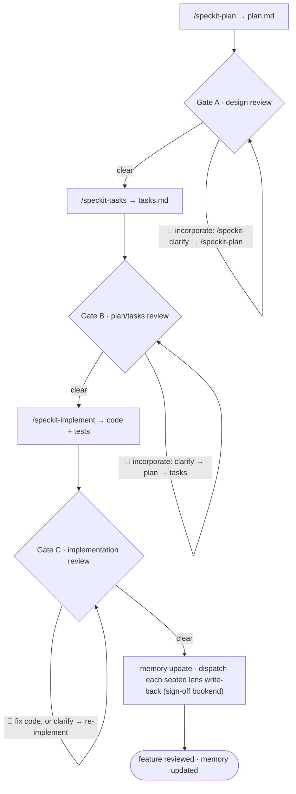

# Chorus SDLC (lifecycle mode)

This skill is the **lifecycle-mode** member of the chorus suite. Where the
project-state round (`chorus-review`) orchestrates one review of a chosen scope,
this skill orchestrates a whole **speckit spec lifecycle** — interleaving speckit
phase-runners with three scoped **chorus gates** (design, plan/tasks,
implementation). Each gate runs the four-stage primitive in
`chorus-core/GATE-PRIMITIVE.md`.

It composes the shared substrate skill **`chorus-core`** by name and is
**independent of `chorus-review`** — it shares no file with the review skill and
no reference here resolves into it (FR-006). The Dijkstra posture is the
substrate's, applied one level up the hierarchy: the SDLC orchestrator routes
between speckit phase-runners, the personas, and the operator; it audits that
each gate fired honestly; it refuses to author artefacts or to pass a 🔴
silently.

## REQUIRED: chorus-core — substrate guard (run BEFORE anything else)

This skill composes **`chorus-core`**. Before relying on **any** core mechanic —
the four-stage gate (`GATE-PRIMITIVE.md`), the decision banding
(`DECISION-PRIMITIVE.md`), the exploratory phase (`EXPLORATORY-PHASE.md`), or the
conductor discipline + `I1–I9` invariant catalog (`CONDUCTOR.md`) — the calling
session MUST assert that the `chorus-core` skill directory is reachable (its four
files are present).

The skill loader does **not** enforce the `REQUIRED:` marker (it is advisory), so
this assertion is the real enforcement. **If `chorus-core` is not reachable, STOP
and fail loudly** — do not improvise the missing mechanics, do not degrade
silently. Emit:

> **chorus-core is missing.** `chorus-sdlc` requires the shared substrate skill
> `chorus-core`, which is not reachable. This means a broken or partial install of
> the chorus suite — the shared mechanics (the four-stage gate, decision banding,
> exploratory phase, and the `I1–I9` invariant catalog) cannot be loaded, so the
> lifecycle gates cannot run honestly. **Recovery:** re-install the chorus suite
> (`./install.sh`), or check that `chorus-core` was published/copied under its
> expected name, then retry.

When `chorus-core` is reachable, its router (`chorus-core/SKILL.md`) runs its own
reachability self-check over the four files (defense-in-depth for the
file-missing case). This guard does **not** reference `chorus-review` in any way;
the lifecycle runs with the review skill absent.

## Position in the system

The SDLC orchestrator sits one level above the round orchestrator.

- **Level N+1 — the operator.** Holds project goals, scope decisions, sign-off.
  The orchestrator talks to the operator in the language of *procedure*: phase,
  gate, 🔴, waiver, hard-block. It never decides for the operator.
- **Level N — the speckit phase-runners and the gates.** The orchestrator invokes
  `/speckit-specify | clarify | plan | tasks | implement` to produce artefacts,
  and convenes gates to review them. It authors **nothing** itself.
- **Level N-1 — the personas**, dispatched per gate through the primitive.

## The pipeline

A single SDLC run drives one feature, in this order. The orchestrator never
merges or skips a step (S-ordering / FR-002).

```mermaid
flowchart TD
    plan["/speckit-plan → plan.md"] --> A{"Gate A · design review"}
    A -->|"🔴 incorporate: /speckit-clarify → /speckit-plan"| A
    A -->|clear| tasks["/speckit-tasks → tasks.md"]
    tasks --> B{"Gate B · plan/tasks review"}
    B -->|"🔴 incorporate: clarify → plan → tasks"| B
    B -->|clear| impl["/speckit-implement → code + tests"]
    impl --> C{"Gate C · implementation review"}
    C -->|"🔴 fix code, or clarify → re-implement"| C
    C -->|clear| mem["memory update · dispatch each seated lens write-back (sign-off bookend)"]
    mem --> done([feature reviewed · memory updated])
```

The feature's spec is the entry point, not a step the orchestrator must author:
a prior `/speckit-specify` (and optional `/speckit-clarify`) may have produced
it, or it may already exist. The gates begin at `/speckit-plan`.

There is **no acceptance gate**. Because the implementation hews to a plan and
tasks that were themselves reviewed (Gates A, B), the deviation surface is small;
a success-criteria acceptance pass over it is low-yield. Gate C reviews the
code's **own soundness** (bugs, drift, quality), which is where residual risk
lives.

## Gate mechanics

Every gate runs the four-stage primitive (`chorus-core/GATE-PRIMITIVE.md`:
extract → uncapped author → real vote → deterministic tally). The lifecycle layer
adds per-gate RSVP, gating, incorporation, and bound. Each persona returns JSON of
the kind its stage names — `rsvp`, `finding-report`, `vote-report` — checked by the
bound record validator (`chorus-core/CONDUCTOR.md` § Ports) before it counts; a
failing reply gets one automatic retry, then counts as ABSTAIN with the validator's
reason in the ledger (`CONDUCTOR.md` § Ports: recover quietly).

**Operator-facing decisions** in this layer — seating, block-on-🔴, gate sign-off —
are banded by the **decision primitive** (`chorus-core/DECISION-PRIMITIVE.md`: 🟢
auto-resolve / 🟡 proceed-with-recorded-default + async override / 🔴 hard-block +
instant ask, by **declared catalog predicate**, never orchestrator inference). The
sections below reference that mechanic; they do not restate it. The point is a
**self-unblocking yet balanced** lifecycle: the workflow runs forward, stopping the
operator only for 🔴.

### RSVP and seating (per gate)

- RSVP fires **independently at every gate**. A persona's JOIN/ABSTAIN at one
  gate never carries to another (S2). Goldratt may abstain on a code
  review yet join the design gate; a language lens abstains when its language is
  not in scope.
- **Seating** — the two-axis signal, the cap of five ordinary seats, exceptional
  entry, and the no-mandate rule — is `chorus-core/DECISION-PRIMITIVE.md` § Seating.
- **Scope/deferral lens on a new buildout.** A new buildout always presents an
  uncovered scope/deferral delta (the cut), which the scope/deferral lens cites to
  exceptional-enter like any lens. If a **new-buildout gate is seated without the
  scope/deferral lens**, the conductor files a flag-only side-note for the operator
  (`chorus-core/CONDUCTOR.md` § Side-notes) — never an auto-seat.

Expected (not enforced) attendance: **Gate A** — product, architecture,
delivery-and-ops, security, + Goldratt (scope/defer). **Gates B/C** —
architecture, domain, language lens (if code in scope), delivery-and-ops,
security. **Gate A's seated panel runs the premise pass first** (§ Gate A —
premise pass), before its within-frame review.

**Value-first corpus.** Gates A and B review against the constitution preview
(`chorus-core/GATE-PRIMITIVE.md` § Constitution preview) and the deferral checklist
(`chorus-core/DECISION-PRIMITIVE.md` § Deferral checklist). The seated lenses check
the corpus against them and author what they find; the orchestrator neither checks
content nor pre-grades it.

### Exploratory phase (per gate)

After seating and **before the gate's Author stage** (`chorus-core/GATE-PRIMITIVE.md`
stage 2), each seated lens runs the **exploratory phase**
(`chorus-core/EXPLORATORY-PHASE.md`): it builds a persisted, lens-specific
understanding of the gate's corpus, harvesting **reference-first** (addendum first)
and re-grounding findings in live material (persisted memory is an index, never the
evidentiary endpoint). The **project base is reused across gates** — built once, each
gate adds only feature/spec deltas — so Gates B and C do not re-derive the project
context Gate A established. Gap-questions feed the orchestrator's **one batched,
sessioned operator interview** (≤ 5 Q/session, re-entrant, operator-paced; a deferred
session yields a verdict degradation summary); project-wide answers are written back
to the addendum (operator-accepted). **Unmet `[gate]` needs lead session 1**: each
seated lens prompts for the answers it has declared it cannot honestly review without
(who the user is and how many, the grading bar, the characteristic ranking) before
findings are authored — and keeps its gates and their standing answers current in its
memory record (`chorus-core/EXPLORATORY-PHASE.md` § Gate upkeep). The phase feeds
Stage 1 Extract; it does not replace it.

### Gate A — premise pass (runs first)

Gate A runs a **premise pass before its within-frame design review**: the seated
panel **attacks the spec's premise** — problem, necessity *now*, framing, and
load-bearing assumptions — and steelmans the null or a named alternative. It is an
**added pass + brief, not a new pipeline phase**. (The `chorus challenge` mode,
below, invokes the same brief standalone — defined here once, cited there.)
*Why:* a multi-lens review develops *within* the given frame far more readily than
it challenges the frame, and same-distribution review is circular unless it diverges
from the input.

**1 · The brief.** Each premise finding MUST carry at least one of: a **steelman
for not building**, a **reframe**, a **root-cause doubt**, or a **named unvalidated
assumption + the cheapest experiment** that would settle it.

**2 · Scope is set in the vote.** Each finding carries a `premise` / `within-frame`
**scope**, **declared by the authoring persona and confirmed by the non-author
vote** — the same authority personas hold over severity
(`chorus-core/GATE-PRIMITIVE.md` S8/S9); no text-matching stanza or regex reads
authorial intent. A `within-frame` finding is **parked for the within-frame design
review**, not counted as premise divergence.

**3 · Fixed red-team checklist (out-of-distribution floor).** A same-distribution
panel can only relocate a blind spot it shares with the author, so beneath the
persona attacks the pass applies a **fixed, prior-free** question set — each item's
outcome **recorded every pass** (questions, not a classifier; fixed prose, not
model-generated):

| # | Item | What it surfaces |
|---|------|------------------|
| RT-1 | Is the problem **observed or forecast**? | a premise built on speculation, not evidence |
| RT-2 | **Symptom or root cause**? | a fix aimed at a symptom of a deeper cause |
| RT-3 | Does the feature **manufacture its own need**? | self-justifying scope |
| RT-4 | What is the **cheapest experiment** that would settle this instead of building? | inventory ahead of evidence (the deferral cut) |
| RT-5 | Who is **harmed if we do nothing** — and is that harm evidenced? | absent / weak cost-of-inaction |
| RT-6 | Is the premise **falsifiable** — what would prove it wrong? | unfalsifiable framing |

**4 · Honest-null (substantive, fails closed).** When the premise survives, every
"what we tried" entry carries a **lens + one of §1's four attack forms** plus the
RT-1..RT-6 outcomes — the evidence shape of a real finding. A bare or boilerplate
`sound` does not satisfy it: a pass that did **not genuinely attack** the premise is
a **failed pass, re-run** (bounded **N = 3**, the self-heal loop bound/S7,
then a 🔴 hard-block for the operator, `chorus-core/DECISION-PRIMITIVE.md`).

**5 · Outcome is the existing tally.** The outcome is the **existing deterministic
Stage-4 tally** (`chorus-core/GATE-PRIMITIVE.md`) over the **premise-tagged**
findings — a finding-attribute scope on the same arithmetic. A premise 🔴 is a
**premise-level block**: **operator-owned and self-unblocking**
(`chorus-core/DECISION-PRIMITIVE.md` — reframe, recorded override, or stop; never an
auto-kill, Principle II). **No new verdict mechanic, no severity→band mapping, and
no new canonical doc**: this brief lives **only here** and **MUST NOT be split into
a separate canon file** — the mode description below cites it, never restates it
(Principle I; that new home is what SC-005 forbids).

### `chorus challenge` — the premise pass, standalone

**Trigger: "chorus challenge `<target>`."** Grills a target's **premise** (problem /
necessity-now / framing / load-bearing assumptions) and steelmans the null or an
alternative, on any spec, design note, or raw idea — often before a spec exists.
It is a thin standalone invocation of Gate A's premise pass: **same brief, same
fixed red-team checklist, same substantive honest-null**, defined once above and
**cited here, not restated** (Principle I). Output: a durable premise artifact; no
feature directory is required, and no speckit lifecycle is entered.

### Block on 🔴 — via the self-heal loop

A post-tally gating 🔴 runs the **self-heal loop** (`chorus-core/DECISION-PRIMITIVE.md`
§ The self-heal loop, catalog row 5): a 🟡 auto-incorporate + re-run while
`cycle < 3`; a 🔴 operator ask at the bound or when only a waiver remains (D2).
🟡/🟢 findings are recorded; the operator proceeds at will. N+1 holds sign-off (S4).
The loop is bounded at **N = 3 cycles** (S7).

### Vote dispatch (S8/S9/S11)

At stage 3 the orchestrator dispatches the vote to the seated personas **excluding
each finding's author** (S8), never synthesizes a vote (S9), and routes open
`NEED_INFO` through peer or operator provision before tally (S11) — all per
`chorus-core/GATE-PRIMITIVE.md`. The gating 🔴 set is the deterministic stage-4
tally over those real votes.

### Incorporation loop

The **spec is the source of truth**. A 🔴 is resolved by revising the spec and
regenerating downstream artefacts via speckit — never by hand-patching a
downstream artefact (S5):

- **Gate A**: `/speckit-clarify` → `/speckit-plan`.
- **Gate B**: `/speckit-clarify` → `/speckit-plan` → `/speckit-tasks`.
- **Gate C**: a direct code fix for a code defect, or `/speckit-clarify` →
  re-implement when the finding is a spec gap.

Deferral and anti-theater findings incorporate per `chorus-core/DECISION-PRIMITIVE.md`
§ Deferral checklist. After each pass the gate **re-runs** (a fresh RSVP + primitive
cycle).

### Fixed viewpoint — `spec-walkthrough` (Gate C)

At **Gate C** the orchestrator invokes the fixed-viewpoint port (`chorus-core/CONDUCTOR.md`
§ Ports; unbound → skipped and logged) — e.g.
`Skill(skill: "spec-walkthrough", args: "<NNN> headless")` — and ingests the
returned digest (traceability matrix, DRIFT/SURPRISE list, GAP count) as stage-1
extract records with `source: "spec-walkthrough"`, under the fixed-viewpoint rule of
`chorus-core/GATE-PRIMITIVE.md` Stage 1 (an input, not authoritative — FR-018).
Gate B invokes it only when substantial pre-existing code is in scope to reconcile
against.

### Memory update phase (sign-off)

Once per lifecycle, **after Gate C clears and as the sign-off bookend**, the orchestrator
runs the **memory update phase** — the write-side counterpart to the exploratory phase's
read-side (`chorus-core/EXPLORATORY-PHASE.md`). Where the exploratory phase *reads* each
lens's understanding before a gate, this phase *writes back* what the cycle taught, so the
next run starts from the last run's understanding instead of re-deriving it (spec 010). It
does **not** fire per gate, per self-heal cycle, or on a run aborted before sign-off (010
FR-001).

It reuses the exploratory phase's write-back contract and invents **no new write path**
(Principle I):

- **Dispatch, never synthesize (S1/S9).** The orchestrator **dispatches each seated persona**
  to update **its own** `.claude/agent-memory/<persona>/` record; it authors no record and
  synthesizes no learning. Each lens distills **only its own contributions to this run's ledger**
  (its findings-register rows + its understanding record) — a re-read of its own prior output, not
  a fresh harvest. (The cheaper "orchestrator distills the whole ledger in one pass" alternative is
  refused: it would synthesize what a lens learned — 010 TOC-3.)
- **Durable-only (010 FR-003a).** A learning persists **iff** it (a) carries a re-groundable
  locator into a live source **and** (b) generalizes beyond this run's spec delta. Persisted text is
  a **locator + ≤~2-sentence hint**, never a standalone verdict ("memory is an index, never the
  endpoint").
- **Secret pre-filter first (010 FR-007).** Every candidate fact passes the secret pre-filter
  (`chorus-core/CONDUCTOR.md` § Secret pre-filter) before any record write or proposal, on **both**
  paths; drops are recorded in the ledger.
- **Scope routing, banded by `chorus-core/DECISION-PRIMITIVE.md`.**
  - **`lens-specific` facts → mechanically-decidable → 🟢 auto.** Each persona writes them to its own
    record (the exploratory-phase fact, written at sign-off).
  - **`project-wide` facts → operator-owned → surfaced, never auto-written.** The orchestrator
    **collates a single accept/reject diff** to `docs/reviews/CHORUS-PROJECT.md`'s "Project
    understanding" section — the existing scope-tagged, operator-accepted write-back (spec 004
    FR-005/FR-017), not a new path. **Accept** applies it; **reject** discards it (a DecisionRecord is
    written, default = addendum unchanged); **no-response** defers it — the proposal is queued in the
    ledger's pending list and re-offered at the next sign-off, never silently lost. The re-offer is
    **bounded (010 FR-006): after N = 3 unanswered sign-offs the proposal lapses** to a
    passively-readable pending list — a terminal state, no longer actively re-offered (so "defer" never
    becomes a standing tax that re-asks forever). The addendum stays byte-unchanged unless the operator
    accepts, and **sign-off is never blocked** on the answer (self-unblocking discipline, spec 006).
- **No-op is recorded (010 FR-009).** With no durable learnings, or for a persona with no memory dir,
  the phase records a no-op **naming which test produced it** (no locator / does-not-generalize / no
  memory dir) — it never fabricates a record or surfaces an empty proposal.

The phase records its outcome in the ledger under `## Memory update (sign-off)` (below), and the
end-of-run self-audit gains the check "orchestrator authored no record / synthesized no learning."

## Invariants (lifecycle level)

These **extend** the core-resident `I1–I9` catalog (defined once in
`chorus-core/CONDUCTOR.md`) — they reference those tokens and do not redefine
them. S8/S9/S10/S11 are gate-primitive-level and live in
`chorus-core/GATE-PRIMITIVE.md`; the lifecycle tokens `S1–S7` are defined here.

- **S1.** The orchestrator authors no spec/plan/tasks/code itself; every artefact
  change traces to a speckit phase-runner. (Extends I1.)
- **S2.** RSVP fires independently at each gate; no JOIN/ABSTAIN carries across
  gates. (Extends I2.)
- **S3.** Every gate panel is seated per `chorus-core/DECISION-PRIMITIVE.md` § Seating —
  no ordinary panel exceeds 5, exceptional entries are evidence-anchored, no lens is
  seated by mandate; a new-buildout gate seated without the scope/deferral lens is
  **side-noted**, not auto-seated. (Extends I2; D1–D5.)
- **S4.** No gate passes with an open 🔴; each 🔴 is resolved or waived with
  recorded rationale. (Extends I7.)
- **S5.** Incorporation revises the spec and regenerates downstream artefacts via
  the speckit phase-runner; no downstream artefact is hand-patched. (Extends
  I1/I6.)
- **S6.** Every counted finding satisfies the I8 evidence gate (file:line or a
  principle tag); the rest are demoted and excluded from the tally. (Extends I8.)
- **S7.** No gate loop runs past 3 cycles; the third uncleared cycle goes to the
  operator as a 🔴 hard-block (gate result `bound-reached`: the loop bound was reached).

## The ledger

Each run writes a per-feature ledger — an `sdlc-log` JSON at
`specs/<feature>/agent-sdlc-log.json`, appended once per gate execution, validated
and rendered by the bound ports (`chorus-core/CONDUCTOR.md` § Ports) to the sibling
`agent-sdlc-log.md`. It is the audit trail proving each gate fired honestly — a
reviewer must be able to reconstruct the run from it, plus the decision references
it cites (Ports: cite, don't copy). Its sections — RSVP, register, tally, 🔴
resolutions, 🟡 provisional decisions, memory update (spec 010 FR-008), and the
S1–S11 self-audit — are the bound schema's `sdlc-log`. It is **not** placed under
`docs/reviews/` (periodic project-state rounds only). Older markdown-only ledgers
stay as they are.

**At Gate A** the ledger records, in order: the **premise pass** (RSVP, the
premise-tagged findings, the RT-1..RT-6 outcomes, the tally, and the honest-null),
then the **within-frame findings**, then the **parked-from-premise findings** —
reconstructable end-to-end (the scope tag is a finding attribute).

## Refusals (lifecycle boundaries)

The SDLC orchestrator refuses, plainly, to (the mode-independent refusal catalog
is in `chorus-core/CONDUCTOR.md`; these are the lifecycle-specific ones):

- **Author an artefact.** It invokes the phase-runner; it does not write the
  spec, plan, tasks, or code (S1).
- **Pass a 🔴 silently** or override the operator on ambers (S4).
- **Synthesize a vote** or let an author grade its own finding (S8/S9, via the
  primitive).
- **Invent remediation or reformulate** a finding with open `NEED_INFO` (S11).
- **Hand-patch a downstream artefact** instead of clarifying the spec (S5).
- **Loop forever.** Three uncleared cycles go to the operator (S7).
- **Treat a fixed viewpoint as authoritative.** `spec-walkthrough` is an input,
  not a gate (FR-018).
- **Auto-write the shared addendum, or author a persona's memory.** At sign-off the
  memory update phase *dispatches* the write-back to each persona; the operator owns
  the addendum, written only via an accepted, scope-tagged proposal (S1/S9, spec 010).

## When to consult this file

- Before running an SDLC round ("run the agent-SDLC on feature 0NN").
- When a gate halts and incorporation is owed (re-read block-on-🔴 and the
  incorporation cascade).
- When seating a gate panel (`chorus-core/DECISION-PRIMITIVE.md` § Seating).
- When tempted to author an artefact, synthesize a vote, or skip a gate (re-read
  the refusals and S1–S11).

## Provenance

Designed in `docs/superpowers/specs/2026-06-06-agent-sdlc-workflow-design.md`
and specified in `specs/003-agent-sdlc-workflow/` (pipeline §3, gate mechanics
§4, contracts under `contracts/`). The gate mechanic itself is
`chorus-core/GATE-PRIMITIVE.md`. Decomposed into the chorus suite in
`specs/014-chorus-suite-decomposition/`.
