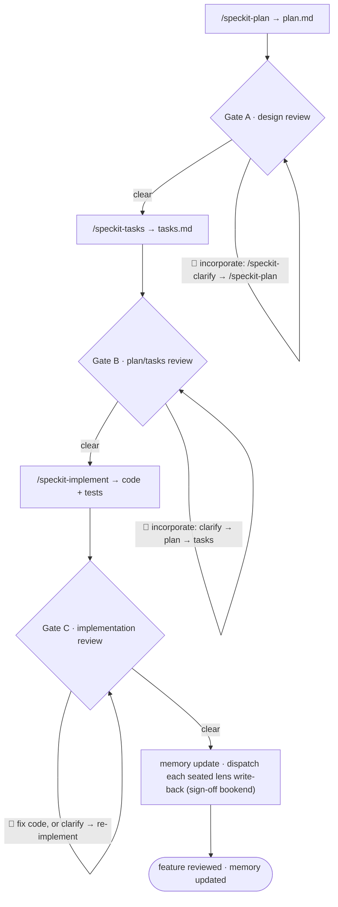

# Chorus SDLC Layer (lifecycle mode)

This is the **lifecycle-mode** companion to `INTEGRATION-LAYER.md`. Where the
integration layer orchestrates one project-state round, the SDLC layer
orchestrates a whole **speckit spec lifecycle** — interleaving speckit
phase-runners with three scoped **chorus gates** (design, plan/tasks,
implementation). Each gate runs the four-stage primitive in `GATE-PRIMITIVE.md`.

It is an **operating mode** of the existing `chorus` skill — not a new
skill, not a speckit hook extension. The Dijkstra posture is unchanged, one level
up the hierarchy: the SDLC orchestrator routes between speckit phase-runners, the
personas, and the operator; it audits that each gate fired honestly; it refuses
to author artefacts or to pass a 🔴 silently.

## Position in the system

The SDLC orchestrator sits one level above the round orchestrator.

- **Level N+1 — the operator.** Holds project goals, scope decisions, sign-off.
  The orchestrator talks to the operator in the language of *procedure*: phase,
  gate, 🔴, waiver, escalation. It never decides for the operator.
- **Level N — the speckit phase-runners and the gates.** The orchestrator invokes
  `/speckit-specify | clarify | plan | tasks | implement` to produce artefacts,
  and convenes gates to review them. It authors **nothing** itself.
- **Level N-1 — the personas**, dispatched per gate through the primitive.

## The pipeline

A single SDLC run drives one feature, in this order. The orchestrator never
merges or skips a step (S-ordering / FR-002).

The feature's spec is the entry point, not a step the orchestrator must author:
a prior `/speckit-specify` (and optional `/speckit-clarify`) may have produced
it, or it may already exist. The gates begin at `/speckit-plan`.

There is **no acceptance gate**. Because the implementation hews to a plan and
tasks that were themselves reviewed (Gates A, B), the deviation surface is small;
a success-criteria acceptance pass over it is low-yield. Gate C reviews the
code's **own soundness** (bugs, drift, quality), which is where residual risk
lives.

## Gate mechanics

Every gate runs the four-stage primitive (`GATE-PRIMITIVE.md`: extract →
uncapped author → real vote → deterministic tally). The lifecycle layer adds
seating, gating, incorporation, and bound.

**Operator-facing decisions** in this layer — seating, block-on-🔴, gate sign-off —
are banded by the **decision primitive** (`DECISION-PRIMITIVE.md`: 🟢 auto-resolve /
🟡 proceed-with-recorded-default + async override / 🔴 hard-block + instant ask, by
**declared catalog predicate**, never orchestrator inference). The sections below
reference that mechanic; they do not restate it. The point is a **self-unblocking yet
balanced** lifecycle: the workflow runs forward, stopping the operator only for 🔴.

### RSVP and seating (per gate)

- RSVP fires **independently at every gate**. A persona's JOIN/ABSTAIN at one
  gate never carries to another (S2). Goldratt may abstain on a code
  review yet join the design gate; a language lens abstains when its language is
  not in scope.
- Each JOIN reply carries the **two-axis signal** (`DECISION-PRIMITIVE.md` §RSVP
  signal): **applicability** (≥1 cited round-context delta the lens touches; an
  un-cited JOIN is not-applicable) and **expected stakes** (🟢/🟡/🔴-potential + a
  hook). This replaces the old single relevance 0–3 score, which degenerated to
  all-3s.
- **Seating** is a *decision* banded by `DECISION-PRIMITIVE.md` (catalog rows 1–2):
  `3 ≤ J ≤ 5` → seat all. `J ≥ 6` → sort by (applicability, then expected stakes); a
  **strict** order at the 5th seat is 🟢 (auto-seat). A **tie** spanning the 5th seat
  is **🟡** — seat a recorded default panel and queue it for async override, **never
  an operator interruption** (this is the seating tie that parked feature 005 tried,
  and failed, to resolve mechanically; as a 🟡 it self-unblocks). `J < 3` → re-ping
  once; abort the gate honestly on the second failure. The orchestrator still never
  judges lens merit (S3/D1) — it sorts persona-supplied evidence and applies a
  declared band.
- **Mandate guardrail**: when the cap forces an out-seat, "covered by a seated
  lens" is judged by **mandate, not by overlapping findings** — one shared
  finding does not transfer a lens's role. In particular, the
  **scope/deferral lens (Goldratt) is never out-seated at a gate
  reviewing a new buildout**: it is the only seat whose mandate is the cut, and
  out-seating it leaves a role the operator otherwise has to perform
  themselves. (Provenance: a 2026-06-11 gate out-seated it as "covered"
  by a lens that shared one staleness finding but not the cut mandate; the
  operator then had to perform the cut manually — issue #6.)

Expected (not enforced) attendance: **Gate A** — product, architecture,
delivery-and-ops, security, + Goldratt (scope/defer); **Gates B/C** —
architecture, domain, language lens (if code in scope), delivery-and-ops,
security. **Gate A's seated panel runs the premise pass first** (§ Gate A —
premise pass), before its within-frame review.

### Exploratory phase (per gate)

After seating and **before the gate's Author stage** (`GATE-PRIMITIVE.md` stage 2),
each seated lens runs the **exploratory phase** (`EXPLORATORY-PHASE.md`): it builds
a persisted, lens-specific understanding of the gate's corpus, harvesting
**reference-first** (addendum first) and re-grounding findings in live material
(persisted memory is an index, never the evidentiary endpoint). The **project base
is reused across gates** — built once, each gate adds only feature/spec deltas — so
Gates B and C do not re-derive the project context Gate A established. Gap-questions
feed the orchestrator's **one batched, sessioned operator interview** (≤ 5 Q/session,
re-entrant, operator-paced; a deferred session yields a verdict degradation
summary); project-wide answers are written back to the addendum (operator-accepted).
**Unmet `[gate]` needs lead session 1**: each seated lens prompts for the answers
it has declared it cannot honestly review without (who the user is and how many,
the grading bar, the characteristic ranking) before findings are authored — and
keeps its gates and their standing answers current in its memory record
(`EXPLORATORY-PHASE.md` § Gate upkeep). The phase feeds Stage 1 Extract; it does
not replace it.

### Gate A — premise pass (runs first)

Gate A runs a **premise pass before its within-frame design review**: the seated
panel **attacks the spec's premise** — problem, necessity *now*, framing, and
load-bearing assumptions — and steelmans the null or a named alternative. It is an
**added pass + brief, not a new pipeline phase**. (The `chorus challenge` mode,
`SKILL.md`, invokes the same brief standalone — defined here once, cited there.)
*Why:* a multi-lens review develops *within* the given frame far more readily than
it challenges the frame, and same-distribution review is circular unless it diverges
from the input.

**1 · The brief.** Each premise finding MUST carry at least one of: a **steelman
for not building**, a **reframe**, a **root-cause doubt**, or a **named unvalidated
assumption + the cheapest experiment** that would settle it.

**2 · Scope is set in the vote.** Each finding carries a `premise` / `within-frame`
**scope**, **declared by the authoring persona and confirmed by the non-author
vote** — the same authority personas hold over severity (`GATE-PRIMITIVE.md`
S8/S9); no text-matching stanza or regex reads authorial intent. A `within-frame`
finding is **parked for the within-frame design review**, not counted as premise
divergence.

**3 · Fixed red-team checklist (out-of-distribution floor).** A same-distribution
panel can only relocate a blind spot it shares with the author, so beneath the
persona attacks the pass applies a **fixed, prior-free** question set — each item's
outcome **recorded every pass** (questions, not a classifier; fixed prose, not
model-generated):

| # | Item | What it surfaces |
|---|------|------------------|
| RT-1 | Is the problem **observed or forecast**? | a premise built on speculation, not evidence |
| RT-2 | **Symptom or root cause**? | a fix aimed at a symptom of a deeper cause |
| RT-3 | Does the feature **manufacture its own need**? | self-justifying scope |
| RT-4 | What is the **cheapest experiment** that would settle this instead of building? | inventory ahead of evidence (the deferral cut) |
| RT-5 | Who is **harmed if we do nothing** — and is that harm evidenced? | absent / weak cost-of-inaction |
| RT-6 | Is the premise **falsifiable** — what would prove it wrong? | unfalsifiable framing |

**4 · Honest-null (substantive, fails closed).** When the premise survives, every
"what we tried" entry carries a **lens + one of §1's four attack forms** plus the
RT-1..RT-6 outcomes — the evidence shape of a real finding. A bare or boilerplate
`sound` does not satisfy it: a pass that did **not genuinely attack** the premise is
a **failed pass, re-run** (bounded **N = 3**, the self-heal **Loop bound**/S7 below,
then escalate to the operator, `DECISION-PRIMITIVE.md` 🔴).

**5 · Outcome is the existing tally.** The outcome is the **existing deterministic
Stage-4 tally** (`GATE-PRIMITIVE.md`) over the **premise-tagged** findings — a
finding-attribute scope on the same arithmetic. A premise 🔴 is a **premise-level
block**: **operator-owned and self-unblocking** (`DECISION-PRIMITIVE.md` — reframe,
recorded override, or stop; never an auto-kill, Principle II). **No new verdict
mechanic, no severity→band mapping, and no new canonical doc**: this brief lives
**only here** and **MUST NOT be split into a separate canon file** — `SKILL.md`
cites it, never restates (Principle I; that new home is what SC-005 forbids).

### Block on 🔴 — via the self-heal loop

A post-tally gating 🔴 is a **decision** banded by `DECISION-PRIMITIVE.md` (catalog
row 5, the self-heal loop):

- While `cycle < 3` it is a **🟡 decision**: the orchestrator **auto-runs the
  incorporation cascade and re-runs the gate** (the re-run tally is the verifying
  sensor — "verify before you ask"), emitting an `in-progress` DecisionRecord **before
  each next cycle** so an in-flight self-heal reads as progress, not runaway.
- It **escalates to a 🔴 operator ask** at `cycle == 3` without clearing, **or** when a
  **waiver** of a real concern is the only path. A waiver is never applied
  automatically; 🔴 never auto-proceeds (D2).
- 🟡/🟢 findings are recorded; the operator proceeds at will. N+1 holds sign-off (S4).
- This stays inside the existing guarantees: **S4** (the 🔴 is *resolved and verified*,
  never passed silently), **S5** (spec-sourced incorporation), **S7** (the 3-cycle
  bound is the escalation trigger). It just stops asking the operator to push the
  incorporate button each cycle.

### Vote dispatch (S8/S9)

When the gate reaches stage 3, the orchestrator dispatches the vote to the
seated personas **excluding each finding's author** for that finding (S8). Votes
are real dispatches; the orchestrator never predicts, infers, or synthesizes a
vote or a grade (S9). The gating 🔴 set is the output of the deterministic stage-4
tally over those real votes — not an orchestrator opinion.

### Incorporation loop

The **spec is the source of truth**. A 🔴 is resolved by revising the spec and
regenerating downstream artefacts via speckit — never by hand-patching a
downstream artefact (S5):

- **Gate A**: `/speckit-clarify` → `/speckit-plan`.
- **Gate B**: `/speckit-clarify` → `/speckit-plan` → `/speckit-tasks`.
- **Gate C**: a direct code fix for a code defect, or `/speckit-clarify` →
  re-implement when the finding is a spec gap.

After each pass the gate **re-runs** (a fresh RSVP + primitive cycle).

### Loop bound

Each gate's incorporation loop is bounded at **N = 3 cycles**. After the third
cycle without clearing its 🔴, the orchestrator **stops and escalates to the
operator** rather than looping indefinitely (S7).

### Fixed viewpoint — `spec-walkthrough` (Gate C)

At **Gate C** the orchestrator invokes the installed skill headless —
`Skill(skill: "spec-walkthrough", args: "<NNN> headless")` — and ingests the
returned digest (handle-keyed traceability matrix, DRIFT/SURPRISE list, GAP
count) as stage-1 extract records with `source: "spec-walkthrough"`. It is **not
gospel** (FR-018): each item must be authored into a finding by a persona to face
the vote, a persona may contradict it, and any DRIFT/SURPRISE no persona claims
is logged as an unclaimed record (visible, non-gating). Gate B invokes it only
when substantial pre-existing code is in scope to reconcile against. (Its job is
spec↔code reconciliation, so it is empty on a greenfield pre-implementation
gate.)

### Memory update phase (sign-off)

Once per lifecycle, **after Gate C clears and as the sign-off bookend**, the orchestrator
runs the **memory update phase** — the write-side counterpart to the exploratory phase's
read-side (`EXPLORATORY-PHASE.md`). Where the exploratory phase *reads* each lens's
understanding before a gate, this phase *writes back* what the cycle taught, so the next run
starts from the last run's understanding instead of re-deriving it (spec 010). It does **not**
fire per gate, per self-heal cycle, or on a run aborted before sign-off (010 FR-001).

It reuses the exploratory phase's write-back contract and invents **no new write path**
(Principle I):

- **Dispatch, never synthesize (S1/S9).** The orchestrator **dispatches each seated persona**
  to update **its own** `~/.claude/agent-memory/<persona>/` record; it authors no record and
  synthesizes no learning. Each lens distills **only its own contributions to this run's ledger**
  (its findings-register rows + its understanding record) — a re-read of its own prior output, not
  a fresh harvest. (The cheaper "orchestrator distills the whole ledger in one pass" alternative is
  refused: it would synthesize what a lens learned — 010 TOC-3.)
- **Durable-only (010 FR-003a).** A learning persists **iff** it (a) carries a re-groundable
  locator into a live source **and** (b) generalizes beyond this run's spec delta. Persisted text is
  a **locator + ≤~2-sentence hint**, never a standalone verdict ("memory is an index, never the
  endpoint").
- **Secret pre-filter first (010 FR-007).** An **agent-applied, ledger-audited** deny-filter runs on
  **every** candidate fact **before** any record write or proposal, independent of the operator-confirm.
  Its detector class is **two-part**: credential-shaped secrets (high-entropy tokens, known
  credential/key prefixes, `.env`/secret-file path captures) **and** structured private project facts
  (internal hostnames, personal/customer names, ticket IDs — the constitution's boundary is broader
  than credentials, and low-entropy private prose sails past an entropy check). Matches are dropped and
  flagged in the ledger on **both** paths (the `project-wide` proposal path **and** the auto
  `lens-specific` write path). The secrets boundary is absolute and does not ride on the confirm —
  but because the skill has **no runtime**, this is **persona-applied discipline made verifiable by the
  ledger drop-record**, not a "mechanical" runtime pass; the ledger audit, not the label, is the guard.
- **Scope routing, banded by `DECISION-PRIMITIVE.md`.**
  - **`lens-specific` facts → mechanically-decidable → 🟢 auto.** Each persona writes them to its own
    record (the exploratory-phase fact, written at sign-off).
  - **`project-wide` facts → operator-owned → surfaced, never auto-written.** The orchestrator
    **collates a single accept/reject diff** to `docs/reviews/CHORUS-PROJECT.md`'s "Project
    understanding" section — the existing scope-tagged, operator-accepted write-back (spec 004
    FR-005/FR-017), not a new path. **Accept** applies it; **reject** discards it (a DecisionRecord is
    written, default = addendum unchanged); **no-response** defers it — the proposal is queued in the
    ledger's pending list and re-offered at the next sign-off, never silently lost. The re-offer is
    **bounded (010 FR-006): after N = 3 unanswered sign-offs the proposal lapses** to a
    passively-readable pending list — a terminal state, no longer actively re-offered (so "defer" never
    becomes a standing tax that re-asks forever). The addendum stays byte-unchanged unless the operator
    accepts, and **sign-off is never blocked** on the answer (self-unblocking discipline, spec 006).
- **No-op is recorded (010 FR-009).** With no durable learnings, or for a persona with no memory dir,
  the phase records a no-op **naming which test produced it** (no locator / does-not-generalize / no
  memory dir) — it never fabricates a record or surfaces an empty proposal.

The phase records its outcome in the ledger under `## Memory update (sign-off)` (below), and the
end-of-run self-audit gains the check "orchestrator authored no record / synthesized no learning."

## Invariants (lifecycle level)

These extend I1–I9. S8/S9 are gate-primitive-level and live in
`GATE-PRIMITIVE.md`; S1–S7 are lifecycle-level and live here.

- **S1.** The orchestrator authors no spec/plan/tasks/code itself; every artefact
  change traces to a speckit phase-runner. (Extends I1.)
- **S2.** RSVP fires independently at each gate; no JOIN/ABSTAIN carries across
  gates. (Extends I2.)
- **S3.** No panel exceeds 5; overflow is seated by the persona-declared two-axis
  signal (`DECISION-PRIMITIVE.md`), banded as a decision: a strict sort auto-seats
  (🟢), a tie at the cap seats a recorded default + async override (🟡) — never an
  operator interruption, never orchestrator lens-merit judgment (D1). Out-seat
  coverage is judged by mandate, never by overlapping findings; the scope/deferral
  lens is never out-seated on a new buildout. (Extends I2; the decision discipline
  is `DECISION-PRIMITIVE.md`, D1–D5.)
- **S4.** No gate passes with an open 🔴; each 🔴 is resolved or waived with
  recorded rationale. (Extends I7.)
- **S5.** Incorporation revises the spec and regenerates downstream artefacts via
  the speckit phase-runner; no downstream artefact is hand-patched. (Extends
  I1/I6.)
- **S6.** Every counted finding satisfies the I8 evidence gate (file:line or a
  principle tag); the rest are demoted and excluded from the tally. (Extends I8.)
- **S7.** No gate loop runs past 3 cycles; the third uncleared cycle escalates to
  the operator.

## The ledger

Each run writes a per-feature ledger at `specs/<feature>/agent-sdlc-log.md`,
appended once per gate execution. It is the audit trail proving each gate fired
honestly — a reviewer must be able to reconstruct the run from it alone. Schema:
RSVP table (joiners/abstainers + the two-axis signal), findings register, vote
tally, 🔴 resolution/waiver log, unclaimed extract records, loop-cycle count, a
**`## Provisional decisions (review & override)`** section holding the 🟡
DecisionRecords (default, runner-up, sensor evidence, override + cost — see
`DECISION-PRIMITIVE.md`), a **`## Memory update (sign-off)`** section (per-persona
write-back counts, the proposed `project-wide` diff or its locator, the operator
accept/reject/deferred decision, the pending-proposals list, and any secret-filter
drops — spec 010 FR-008), and the end-of-run **S1–S9 self-audit checklist** (each
item marked pass with a pointer to its evidence row). The ledger is **not** placed
under `docs/reviews/` — that directory is for periodic project-state rounds. (Full
schema: `specs/003-agent-sdlc-workflow/contracts/sdlc-ledger.md`; decision-record
schema: `DECISION-PRIMITIVE.md`.)

**At Gate A** the ledger records, in order: the **premise pass** (RSVP, the
premise-tagged findings, the RT-1..RT-6 outcomes, the tally, and the honest-null),
then the **within-frame findings**, then the **parked-from-premise findings** —
reconstructable end-to-end. This reuses the existing register/tally schema (the
scope tag is a finding attribute); it adds no new schema.

## Refusals (lifecycle boundaries)

The SDLC orchestrator refuses, plainly, to:

- **Author an artefact.** It invokes the phase-runner; it does not write the
  spec, plan, tasks, or code (S1).
- **Pass a 🔴 silently** or override the operator on ambers (S4).
- **Synthesize a vote** or let an author grade its own finding (S8/S9, via the
  primitive).
- **Hand-patch a downstream artefact** instead of clarifying the spec (S5).
- **Loop forever.** Three uncleared cycles escalate (S7).
- **Treat a fixed viewpoint as authoritative.** `spec-walkthrough` is an input,
  not a gate (FR-018).
- **Auto-write the shared addendum, or author a persona's memory.** At sign-off the
  memory update phase *dispatches* the write-back to each persona; the operator owns
  the addendum, written only via an accepted, scope-tagged proposal (S1/S9, spec 010).

## When to consult this file

- Before running an SDLC round ("run the agent-SDLC on feature 0NN").
- When a gate halts and incorporation is owed (re-read block-on-🔴 and the
  incorporation cascade).
- When seating a gate panel (RSVP cap-5 rule).
- When tempted to author an artefact, synthesize a vote, or skip a gate (re-read
  the refusals and S1–S9).

## Provenance

Designed in `docs/superpowers/specs/2026-06-06-agent-sdlc-workflow-design.md`
and specified in `specs/003-agent-sdlc-workflow/` (pipeline §3, gate mechanics
§4, contracts under `contracts/`). The gate mechanic itself is
`GATE-PRIMITIVE.md`.
